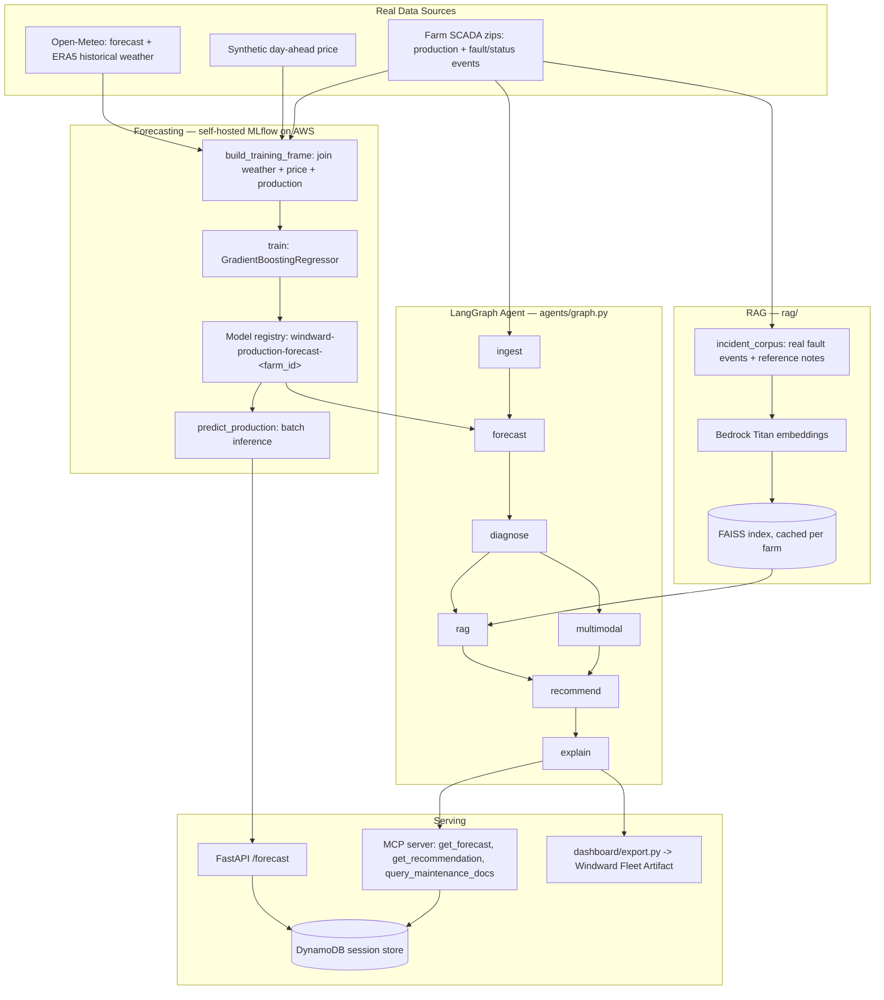
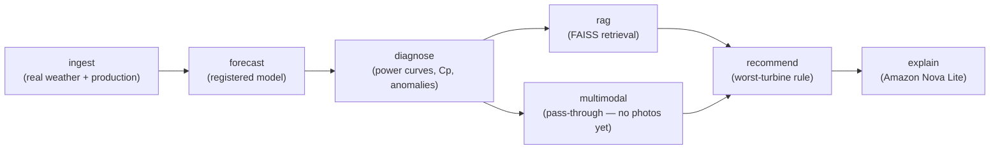

# 🌬️ Windward — Wind Farm Power Prediction

> **Live:** [windward.forwardforecasting.eu](https://windward.forwardforecasting.eu/health) — a real, persistently-running FastAPI service on AWS. A multi-agent AI system for wind farm production forecasting and operations support: classic ML forecasting tracked with self-hosted **MLflow**, a **LangGraph** agent workflow for diagnosis and recommendations, **two independent RAG stacks** (LangChain/FAISS + LlamaIndex) over real turbine data, a **multimodal** vision-LLM blade-inspection pass, and real **DynamoDB** session persistence — exposed via a **FastAPI** service and an **MCP server** so the agent's tools are callable from Claude or any MCP client.

**Status:** end-to-end on **real data**, three farms, running as a real AWS service — real historical weather (Open-Meteo) joined with real turbine production (Kelmarsh + Penmanshiel + Hill of Towie open SCADA datasets, two different export formats), per-farm models trained and registered in a self-hosted MLflow registry (S3-backed). The full LangGraph agent runs for any farm: ingest → forecast → diagnose (physics-based efficiency + anomaly detection) → RAG (real fault-event corpus, Bedrock Titan embeddings, FAISS) → multimodal (real vision-LLM blade check) → recommend → explain (Amazon Nova Lite), every run persisted to DynamoDB. Dashboard: **[windward.forwardforecasting.eu](https://windward.forwardforecasting.eu/)** (one tab per farm, real charts, and a live "ask the agent" box backed by Bedrock — no viewer-billed sandbox capability involved). Write-up: **[Teaching an Agent to Read Wind Farms](https://education.forwardforecasting.eu/windward-agent/)**.

**Started as a deliberate skill demonstration** (Azure MLflow, RAG, agentic workflows, MLOps — see §2), then pivoted toward becoming an actual product: migrated off Azure onto AWS (see §12), now deployed as a persistent service, with plans to combine it with an energy-price-prediction model and commercialize both. A separate, simpler project will pick up the Azure MLflow demonstration going forward.

**Exercises:** LangChain · LangGraph · RAG · LlamaIndex · Semantic Search · MCP servers · REST APIs (FastAPI) · Pydantic · LiteLLM · Langfuse/LangSmith · Multimodal LLMs · DynamoDB · MLflow · generative AI workflow architecture.

---

## Table of Contents

1. [Project Overview](#1-project-overview)
2. [Skill → Component Map](#2-skill--component-map)
3. [Architecture & Data Flow](#3-architecture--data-flow)
4. [Agent Workflow](#4-agent-workflow)
5. [Data Sources](#5-data-sources)
6. [Data Processing Pipeline](#6-data-processing-pipeline)
7. [Libraries & AI Technologies](#7-libraries--ai-technologies)
8. [Forecasting Model](#8-forecasting-model)
9. [Project Structure](#9-project-structure)
10. [Setup](#10-setup)
11. [Roadmap](#11-roadmap)
12. [Cost & Resource Consumption](#12-cost--resource-consumption)

---

## 1. Project Overview

Windward forecasts wind farm energy production and pairs the forecast with an agentic layer that explains it, flags anomalies, and recommends actions (e.g. turbine inspection, curtailment cross-checks) in natural language. It ingests real meteorological data and real turbine SCADA production, trains and tracks forecasting models through a self-hosted MLflow tracking server, and orchestrates a multi-step reasoning workflow on top with LangGraph — served persistently as a real API at [windward.forwardforecasting.eu](https://windward.forwardforecasting.eu/health).

The split is deliberate: forecasting is a numerical ML problem (best solved with a regression model, tracked and versioned like any ML project); the agent layer is where an LLM adds value — turning a forecast + anomaly signal into a grounded, explainable recommendation, using retrieval over real documents (a real turbine fault-event log, not hallucinated domain knowledge).

## 2. Skill → Component Map

| Skill | Where it lives |
|---|---|
| Architect generative AI workflows | `agents/graph.py` — the LangGraph state machine |
| Build RAG systems | `rag/langchain_retriever.py`, `rag/incident_corpus.py` — retrieval over a real turbine fault-event corpus |
| Integrate LLM APIs | `agents/llm_router.py`, routed through LiteLLM (AWS Bedrock Nova) |
| Build MCP servers | `mcp_server/` — forecast/diagnosis/RAG tools exposed over MCP |
| Build REST APIs | `api/` — FastAPI service |
| DynamoDB | `storage/dynamo_session_store.py` — every agent run persisted as a real session record |
| LangChain | `rag/langchain_retriever.py`, `rag/embeddings.py` — retriever + custom embeddings wrapper |
| LangGraph | `agents/graph.py` — ingest → forecast → diagnose → rag/multimodal → recommend → explain |
| Langfuse / LangSmith | `observability/tracing.py`, wired into every graph run via `agents.graph.run()` — no-ops until `LANGFUSE_*` keys are set (blocked on the user's own free signup, see §12) |
| LiteLLM | `agents/llm_router.py` — provider-agnostic model calls |
| Pydantic | `schemas/models.py` — every tool/agent I/O contract |
| LlamaIndex | `rag/llamaindex_index.py` — second, independent RAG stack over turbine spec metadata |
| Multimodal | `multimodal/blade_inspection.py` — real vision-LLM pass (Bedrock Nova, Converse API) on a real inspection photo |
| Semantic Search | `rag/semantic_search.py` — nearest-neighbor search over the real incident corpus |
| MLflow | `forecasting/train.py`, `forecasting/registry.py` — self-hosted tracking server + registry, S3 artifact store (originally Azure ML, migrated — see §12) |

## 3. Architecture & Data Flow



## 4. Agent Workflow

The LangGraph agent (`agents/graph.py`) runs once per farm, in analysis mode over that farm's real SCADA period — this is the only period with real production data to diagnose against. Each node returns only the state keys it changes (a LangGraph fan-out/fan-in requirement, since `rag` and `multimodal` run as parallel branches before `recommend`):



| Node | What it does |
|---|---|
| `ingest` | Builds the real training frame (weather + production) and per-turbine hourly series for the farm |
| `forecast` | Loads the farm's registered MLflow model, predicts across the whole period, builds an actual-vs-predicted comparison |
| `diagnose` | Computes per-turbine power curves + efficiency (Cp vs the Betz limit, `analysis/efficiency.py`), flags farm-level forecast deviation and physically-implausible Cp readings |
| `rag` | Retrieves the most relevant real fault events + reference notes for this farm from its FAISS index |
| `multimodal` | Pass-through today — no inspection photos sourced yet (roadmap) |
| `recommend` | Rule-based: flags the lowest-capacity-factor turbine, cites the RAG sources used |
| `explain` | Calls Amazon Nova Lite with the diagnosis + recommendation + retrieved context, returns a grounded natural-language field report |

## 5. Data Sources

Farms live in `data_sources/farms.py` (`FARMS` registry). All three are real, open, CC BY 4.0 SCADA datasets, but not all in the same export format: Kelmarsh and Penmanshiel are Cubico Sustainable Investments' Greenbyte export (`data_sources/greenbyte_scada.py`); Hill of Towie is RES's own historian export, one CSV per signal-group table per month instead of one CSV per turbine (`data_sources/hill_of_towie_scada.py`). Callers use `data_sources.farms.loader_for(farm)` to get the right module rather than importing one directly — see `Farm.data_source`.

| Farm | Turbines | Capacity | Location | Dataset |
|---|---|---|---|---|
| `kelmarsh` | 6x Senvion MM92 | 12.3 MW | Northamptonshire, UK | [Zenodo DOI 10.5281/zenodo.5841834](https://zenodo.org/records/5841834), 2016 (~98MB) |
| `penmanshiel` | 14x Senvion MM82 | 28.7 MW | Scottish Borders, UK | [Zenodo DOI 10.5281/zenodo.5946808](https://zenodo.org/records/5946808), 2016 (~185MB, split by turbine group) |
| `hill_of_towie` | 21x Siemens SWT-2.3-VS-82 | 48.3 MW | Aberdeenshire, Scotland, UK | [Zenodo DOI 10.5281/zenodo.14870023](https://zenodo.org/records/14870023), 2024 only so far (~1GB; the full dataset spans 2016–2024, one ~1-1.6GB zip per year) |

Datasets considered from the same open-SCADA research and excluded, with why: **CARE to Compare** (Zenodo 10958775) — 2 of its 3 farms are anonymized with no public coordinates, and the third is the same underlying EDP data as below; a great anomaly-detection benchmark, not a farm we can register with a real location. **EDP open dataset** (Mendeley `zjxjnjp3xs`, onshore Portugal — the earlier research pass had mislabeled it as Spain) — real and CC BY 4.0, but discloses no turbine/farm coordinates and no rated power/rotor diameter, which `Farm` requires. **SMARTEOLE** — a wake-steering experiment, not steady farm production. **Aventa AV-7** — a single research turbine, not a farm. **Pedra do Sal / Beberibe** — real coastal farms, but published as SCADA+LiDAR+turbulent-flux NetCDF, a different data model entirely. **Altahullion** — couldn't independently verify this dataset exists under a citable DOI; not added without that.

| Data | Source | Status |
|---|---|---|
| Turbine production (training target) | Per-farm SCADA zips, downloaded to `data/<farm>/` (gitignored). Parsed + resampled to hourly farm-level totals via `load_farm_hourly_production`; per-turbine wind speed + power via `load_turbine_hourly_series`. | **Real.** |
| Turbine fault/status events (RAG corpus) | Same zips' `Status_*.csv` files — real Stop/Warning/Informational event log with codes and messages (e.g. "Low gearbox oil pressure"). Parsed via `load_status_events`. | **Real.** |
| Meteorological (wind speed/direction, pressure, temp) | Open-Meteo — live forecast API + ERA5 historical archive, free, no key | **Real, live.** Historical archive feeds training (`fetch_historical`) for the same period as the SCADA data, at the farm's real coordinates — deliberately independent of the turbines' own anemometers, since that's what's actually available at forecast time. API defaults to km/h — explicitly requested in m/s to match the schema. |
| Day-ahead energy price | ENTSO-E Transparency Platform | Synthetic day/night curve — GB's post-Brexit price data doesn't map cleanly onto ENTSO-E's EU day-ahead product this client targets, and it isn't load-bearing for the forecasting demo. `entsoe-py` client is implemented and works for EU bidding zones if `ENTSOE_API_TOKEN` is set. |
| Turbine spec metadata (LlamaIndex corpus) | Same datasets' `*_WT_static.csv` files — manufacturer, model, hub height, exact per-turbine coordinates, commercial-ops date. Parsed via `load_turbine_static`. | **Real.** |
| Blade inspection photo (multimodal demo) | One real photo, [Wikimedia Commons, CC BY-SA 3.0](https://commons.wikimedia.org/wiki/File:Begutachtung_eines_Rotorblattes.JPG) — a rope-access technician inspecting a turbine blade. Not a live drone feed (not sourced yet), but a real photo run through a real vision-LLM call, not a placeholder. | **Real (single sample).** |

To reproduce:
```bash
curl -L -o data/kelmarsh/Kelmarsh_SCADA_2016.zip "https://zenodo.org/records/5841834/files/Kelmarsh_SCADA_2016_3082.zip?download=1"
curl -L -o data/penmanshiel/Penmanshiel_SCADA_2016_WT01-10.zip "https://zenodo.org/records/5946808/files/Penmanshiel_SCADA_2016_WT01-10_3107.zip?download=1"
curl -L -o data/penmanshiel/Penmanshiel_SCADA_2016_WT11-15.zip "https://zenodo.org/records/5946808/files/Penmanshiel_SCADA_2016_WT11-15_3107.zip?download=1"
curl -L -o data/hill_of_towie/2024.zip "https://zenodo.org/api/records/14870023/files/2024.zip/content"
curl -L -o data/hill_of_towie/Hill_of_Towie_turbine_metadata.csv "https://zenodo.org/api/records/14870023/files/Hill_of_Towie_turbine_metadata.csv/content"
curl -L -o data/hill_of_towie/Hill_of_Towie_alarms_description.csv "https://zenodo.org/api/records/14870023/files/Hill_of_Towie_alarms_description.csv/content"
```

## 6. Data Processing Pipeline

**Training path** (`python -m forecasting.train`, once per farm):

1. `forecasting.pipeline.build_training_frame(farm)`
   - `greenbyte_scada.load_farm_hourly_production(farm.scada_zips)` — parses the raw 10-minute SCADA CSVs from inside the dataset zip(s), resamples to hourly per turbine, clips negative readings to zero, sums across turbines → real farm-level hourly MW.
   - `meteo_client.fetch_historical(lat, lon, start, end)` — pulls real ERA5 historical weather for the *exact* SCADA date range, at the farm's real coordinates.
   - `energy_price_client.synthetic_prices(...)` — a synthetic day/night price curve aligned to the same timestamps (see §5 for why this one isn't real).
   - Joins all three on timestamp, engineers `hour_of_day` and `wind_speed_cubed` (physically motivated — power ∝ v³), drops incomplete rows.
2. `forecasting.train.train(farm_id, df)` — 80/20 split, fits the model, logs params/metrics/model to the self-hosted MLflow server, registers it as `windward-production-forecast-<farm_id>`.

**Inference path** (`POST /forecast`):

3. `forecasting.predict.predict_production(farm_id, horizon_hours)` — pulls *live, forward-looking* weather from Open-Meteo's forecast API, builds the same feature set, loads the latest registered model from the MLflow registry, predicts. This is what `windward.forwardforecasting.eu`'s `/forecast` endpoint calls.

**Agent path** (`agents/graph.py`, see §4 for the node-by-node breakdown) — re-derives the training frame plus per-turbine series, runs the registered model across the whole period for an actual-vs-predicted comparison, computes efficiency/anomalies, retrieves grounding context, and narrates a recommendation.

**Dashboard export** (`dashboard/export.py`) — runs the full agent graph once per registered farm and flattens the results (daily actual-vs-predicted, per-turbine power curves, efficiency table, anomalies, field report) into one JSON payload consumed by the published **Windward Fleet** dashboard.

## 7. Libraries & AI Technologies

Grouped by the AI capability each one supports — only libraries actually used in this project are explained:

**Agentic AI / workflow orchestration**
- **LangGraph** — a state-machine framework for building multi-step agent workflows as a directed graph of nodes sharing typed state. Used for the whole ingest → forecast → diagnose → rag → multimodal → recommend → explain pipeline (§4), instead of one hand-rolled function, so each step is independently testable, composable, and (with a checkpointer, not yet added) resumable.
- **LiteLLM** — a unified completion API that targets different LLM providers (Bedrock, OpenAI, Azure OpenAI, …) by changing only a model string. Used in `agents/llm_router.py` so the agent code isn't hard-wired to one vendor's SDK, even though only Bedrock Nova is actually wired up today.

**Retrieval-Augmented Generation (RAG) & embeddings**
- **LangChain** (`langchain-community`) — supplies the `Document` abstraction and the FAISS vector-store integration used by the retriever (`rag/langchain_retriever.py`).
- **FAISS** (`faiss-cpu`) — Meta's similarity-search library; the actual vector index behind both the RAG retriever and the standalone semantic-search tool. Stores embeddings for the incident/reference corpus and finds nearest neighbors fast, cached to disk per farm so it isn't rebuilt (re-embedded) on every run.
- **Amazon Titan Text Embeddings v2** (via `boto3`, wrapped in a ~15-line custom LangChain `Embeddings` class) — turns each fault-event/reference-note document into a 1024-dim vector for FAISS. Chosen over the chat models because Titan embeddings are invocable on-demand in `eu-west-1` (no inference-profile requirement, unlike the newer Nova chat models — see below).
- **LlamaIndex** (`rag/llamaindex_index.py`) — a second, independent retrieval framework, over a different corpus: structured turbine spec/metadata (manufacturer, hub height, exact coordinates) rather than incident narratives. Needed a small custom `CustomLLM` wrapper too — LlamaIndex's query engine defaults to OpenAI for response synthesis, so without pointing it at the same Bedrock Nova model the rest of the project uses, it would silently require an OpenAI key.

**LLM integration**
- **Amazon Nova Lite** (via LiteLLM/Bedrock) — the generation model behind `explain_node`'s field report. Invoked as `bedrock/eu.amazon.nova-lite-v1:0`, an EU cross-region *inference profile* — a real gotcha hit during development: bare Bedrock model IDs aren't invocable on-demand in `eu-west-1` for this model family, only via a region-prefixed inference profile.
- **Amazon Nova Lite, multimodal** (`multimodal/blade_inspection.py`, direct Bedrock Converse API) — the same model family, called with an image content block instead of text-only, for the blade-inspection vision pass.
- **MCP (Model Context Protocol)** — the open protocol/SDK for exposing tools to LLM clients (Claude and others) in a standard way. `mcp_server/` exposes `get_forecast`, `get_recommendation`, and `query_maintenance_docs` over MCP, so an external agent can operate Windward's capabilities directly rather than only via a bespoke REST call.
- **Claude `sample` capability** (dashboard chat panel, client-side JS, no Python library) — lets the published Windward Fleet Artifact ask Claude a question directly from the browser. Deliberately chosen over wiring the chat to Windward's own Bedrock backend: `sample` bills the *viewer's* own Claude usage, not this project's AWS bill, so the feature is free to run regardless of traffic — the trade-off is that a viewer needs their own Claude account and to consent on first use.

**Observability**
- **Langfuse** (`observability/tracing.py`) — LLM/agent tracing, wired into every `agents.graph.run()` call via LangChain's callback mechanism. Auto-detects whether `LANGFUSE_PUBLIC_KEY`/`SECRET_KEY` are set and no-ops otherwise, so the code path is real even before the (free) Langfuse account exists.

**MLOps**
- **MLflow** — the open-source experiment-tracking/model-registry standard. Self-hosted here: a small systemd service on the same EC2 as the app, SQLite backend store, S3 artifact store. Every training run's params/metrics/model artifact is logged and versioned, per farm.
- **boto3** — used both for the MLflow server's S3 artifact access and for every AWS call the app makes (Bedrock, DynamoDB). Auth throughout is the EC2 instance's IAM role, picked up automatically from instance metadata — no static keys anywhere.

**Classic ML & data**
- **scikit-learn** — supplies `GradientBoostingRegressor` for production forecasting (§8), plus the train/test split and MAE/R² metrics.
- **pandas** — all the time-series joining/resampling (SCADA → hourly, weather ↔ production ↔ price alignment).
- **Pydantic** — defines every typed contract in the project (`schemas/models.py`): weather/price/production records, forecast requests/results, tool I/O. This is the "structured output" discipline that matters once an LLM is in the loop — it constrains what the agent's tools can actually accept or return, rather than passing loose dicts around.

**Serving**
- **FastAPI** + **uvicorn** — FastAPI is a Python web framework built on type hints and Pydantic for automatic request/response validation; uvicorn is the ASGI server that runs it. Chosen (over Flask/Django) specifically because it reuses the same Pydantic schemas already defined for the agent's tools, so the REST layer and the agent layer never disagree on shape.

**Deliberately not used:** Kafka and GraphQL don't fit this project's shape (batch/agent-run workloads, not event streaming or a graph-shaped API surface) and aren't part of the stack.

## 8. Forecasting Model

**Model:** `sklearn.ensemble.GradientBoostingRegressor`, one instance trained per farm.

**Why this model:** the problem is tabular regression — a handful of physically meaningful features (wind speed, its cube, direction, temperature, pressure, price, hour-of-day) predicting a continuous target (farm MW output) — on a moderate dataset (a few thousand hourly rows per farm). Gradient-boosted trees are a strong, well-understood default for exactly this shape of problem: they usually match or beat deep learning here with far less tuning and no GPU — training takes seconds on a small EC2 instance, no dedicated compute cluster needed.

**Strengths for this specific problem:**
- Captures the non-linear cubic relationship between wind speed and power, and interaction effects (e.g. wind speed × time-of-day), without manual feature crosses.
- Robust to the mixed feature scales present (m/s, degrees, hPa, EUR/MWh) — no normalization step needed.
- Robust to noisy/outlier-heavy targets, which matters because real SCADA production includes curtailment and downtime events that don't follow the physical power curve.
- Feature importances give a cheap sanity check that the model is actually leaning on wind speed, not spurious correlations.

**Configuration** (`forecasting/train.py`):
```python
GradientBoostingRegressor(n_estimators=200, max_depth=4, learning_rate=0.05, random_state=42)
```
80/20 train/test split, evaluated on held-out MAE (MW) and R².

**Features** (`forecasting/features.py`): `wind_speed_ms`, `wind_speed_cubed`, `wind_direction_deg`, `temperature_c`, `pressure_hpa`, `price_eur_mwh`, `hour_of_day`. **Target:** `output_mw` (farm-level, summed across turbines).

**Results, held-out test set:**

| Farm | MAE | R² |
|---|---|---|
| Kelmarsh | 1.06 MW | 0.73 |
| Penmanshiel | 1.98 MW | 0.81 |
| Hill of Towie | 4.29 MW | 0.74 |

These are meaningfully harder, more honest numbers than an early synthetic-production prototype's R² 0.95 — real SCADA carries wake effects, curtailment, and downtime the model has to learn around, which is the actual point of using real data.

## 9. Project Structure

```
windward/
├── agents/            # LangGraph workflow + node agents, LiteLLM router
├── analysis/           # physics: power-curve binning, Cp/Betz efficiency
├── data_sources/        # meteo / price / SCADA clients, farm registry
├── forecasting/          # feature engineering, training, registry, prediction
├── rag/                   # LangChain retriever, embeddings, incident corpus, semantic search
├── multimodal/             # blade inspection vision pipeline (real vision-LLM pass, §7)
├── mcp_server/              # MCP tool server
├── api/                      # FastAPI service — this is what runs at windward.forwardforecasting.eu
├── schemas/                   # Pydantic models (tool I/O contracts)
├── observability/               # Langfuse tracing, wired into every graph run (§2)
├── storage/                       # DynamoDB session store
├── dashboard/                      # exports agent output -> published Artifact
├── Dockerfile / docker-compose.prod.yml  # the persistent deployment (§12)
├── web/                               # static dashboard served by the FastAPI app at windward.forwardforecasting.eu
├── infra/
│   ├── aws/                            # the live deployment — what's actually running, and how to reproduce it
│   └── azure/                          # Azure ML setup notes (historical — the account has been decommissioned)
├── tests/
└── docs/
    └── ARCHITECTURE.md
```

## 10. Setup

```bash
python -m venv .venv && source .venv/bin/activate
pip install -r requirements.txt
cp .env.example .env   # fill in AWS region / MLflow tracking URI
```

Runs against a self-hosted MLflow server (`MLFLOW_TRACKING_URI`, defaults to `http://127.0.0.1:5000`) and picks up AWS credentials from the environment — an EC2 instance role in production, or your own AWS CLI profile locally. No Azure account needed anymore.

## 11. Roadmap

- [x] Data source clients (meteo, price) + Pydantic schemas
- [x] Real production data — Kelmarsh + Penmanshiel + Hill of Towie open SCADA datasets
- [x] Baseline forecasting model, MLflow experiment tracking, per-farm registered models (§8)
- [x] Batch inference + FastAPI `/forecast` endpoint
- [x] LangGraph agent, all 7 nodes real (§4)
- [x] Multi-farm support — farm registry + per-farm loader dispatch (`data_sources.farms.loader_for`), now spanning two different SCADA export formats (Greenbyte, RES historian); three farms live (Kelmarsh, Penmanshiel, Hill of Towie), each trained, registered, and served through the full agent
- [x] RAG corpus — real turbine fault/status events + reference notes, Bedrock Titan embeddings, FAISS per farm
- [x] Semantic search — same FAISS index, direct similarity search
- [x] MCP server — `get_forecast`, `get_recommendation`, `query_maintenance_docs` all implemented
- [x] Dashboard — **[windward.forwardforecasting.eu](https://windward.forwardforecasting.eu/)**, served directly by the FastAPI app (`web/`): per-farm tabs, real charts, Betz-limit efficiency table, vision-LLM blade inspection, and a live "ask the agent" box hitting Bedrock directly. Started as a Claude Artifact (the only way to get an interactive AI feature inside a sandboxed page that can't call external APIs), moved to a real self-hosted frontend once the project stopped being a portfolio piece and started being a service
- [x] LlamaIndex — second, independent RAG stack (`rag/llamaindex_index.py`) over real turbine spec metadata (manufacturer, hub height, exact coordinates), a different framework and a different corpus shape from the LangChain/FAISS incident-log stack. Verified: correctly answers "what is the hub height of Kelmarsh 3?" (68.5m, matches the source CSV) and cross-farm elevation comparisons
- [x] Langfuse tracing — `observability/tracing.py` (updated for the current Langfuse v4 API — `langfuse.langchain.CallbackHandler`, not the old `langfuse.callback` path) wired into every graph run via `agents.graph.run()`. Auto-activates when `LANGFUSE_PUBLIC_KEY`/`LANGFUSE_SECRET_KEY` are set; currently a no-op since that needs the user's own free Langfuse signup (same category of blocker as Power BI)
- [x] Multimodal blade-inspection node — real vision-LLM call (Amazon Nova Lite via the Bedrock Converse API) against a real, openly-licensed inspection photo ([Wikimedia Commons, CC BY-SA 3.0](https://commons.wikimedia.org/wiki/File:Begutachtung_eines_Rotorblattes.JPG)), wired into `multimodal_node` and folded into the field-report narrative
- [x] DynamoDB session store — every dashboard export run now writes a real session record (farm, timestamp, mean capacity factor, recommendation, model metrics) via `storage/dynamo_session_store.py`; verified with a live `aws dynamodb scan`
- [x] Explanatory write-up — **[Teaching an Agent to Read Wind Farms](https://education.forwardforecasting.eu/windward-agent/)**, self-hosted (not just a Claude Artifact), listed on the **[Field Notes](https://education.forwardforecasting.eu/)** blog index
- [x] **Migrated off Azure onto AWS** (§12) — self-hosted MLflow (systemd + SQLite + S3) and the FastAPI+agent service (Docker, host networking) now run persistently on `forwardforecasting-dev`, an existing EC2 instance (its idle-shutdown automation was disabled so this stays up). Live at **[windward.forwardforecasting.eu](https://windward.forwardforecasting.eu/health)**, real HTTPS via Let's Encrypt. Verified: both `/health` and `/forecast` respond correctly through the public domain. Auth is the EC2 instance's IAM role — no static AWS keys anywhere.
- [x] Azure account cleanup — `rg-windward` (the Azure ML workspace and everything it backed) deleted once the AWS replacement was verified working.
- [x] ~~Spain day-ahead price forecasting (`spain_price/`)~~ — added, then removed 2026-09-09: national day-ahead price prediction doesn't belong bundled into a wind-farm-production project whose farms are all in the UK, and it's now its own project, `energy-trader` (real OMIE ingestion, forecasting, backtesting) — see that repo instead.
- [ ] Power BI version of the dashboard — moot now the project isn't Azure-hosted; not pursuing further
- [ ] Wire FastAPI to the LangGraph agent's recommend/explain output, not just the raw forecast
- [ ] A separate, simpler project to pick up the Azure MLflow skill demonstration

## 12. Cost & Resource Consumption

**Anthropic** is not called by the running system at all — Claude Code was the *development* tool used to build Windward (a separate, development-time cost, not part of this project's runtime bill); the MCP server exposes tools *to* Claude-compatible clients rather than calling Anthropic's API. Everything below is **AWS**, and it's genuinely marginal: the service runs as one more Docker container + one more systemd service on `forwardforecasting-dev`, an EC2 instance already running and already paid for (it hosts `job-hunter-suite` and others). Nothing here required provisioning a new host.

| Category | Resource | Cost |
|---|---|---|
| **Compute** | FastAPI + agent service (Docker, host networking, 700MB memory limit) on the existing EC2 | $0 marginal — the box is already running |
| **Compute** | MLflow tracking server (native systemd service, ~180MB RSS) on the same EC2 | $0 marginal |
| **Storage** | S3 bucket `windward-mlflow-artifacts-ff` (model artifacts, versioned) | Within the AWS always-free tier (5GB/12mo) at this scale; a few cents/month after |
| **Storage** | Raw SCADA data, FAISS/LlamaIndex indexes | $0 — local disk on the EC2, not cloud storage. Hill of Towie's one-year sample (~1GB) is ~5x the size of both Greenbyte farms combined, still trivial on disk |
| **Connectivity** | nginx + Let's Encrypt SSL for `windward.forwardforecasting.eu` | $0 — reuses the existing domain/cert infrastructure |
| **AI services** | Amazon Nova Lite (`explain_node` narration + multimodal vision) | <$0.01/mo at current call volume ($0.06/$0.24 per MTok in/out) |
| **AI services** | Amazon Titan Embeddings v2 (RAG index build, one-time per farm unless the corpus changes) | <$0.001 one-time per farm |
| **AI services** | DynamoDB `windward-agent-sessions` (on-demand billing) | $0 — within the AWS always-free tier (25GB + 25 RCU/WCU) at this scale |

**Estimated total: under $0.10/month, indefinitely.** Auth throughout is the EC2 instance's IAM role (`forwardforecasting-dev-ssm-role`, scoped to exactly this S3 bucket, this DynamoDB table, and the two Bedrock models used) — no static AWS keys anywhere in the codebase or on the server.

### Why AWS, not Azure — the decision that drove the migration

The project's original Azure ML phase was a real, verified skill demonstration (see [infra/azure/README.md](infra/azure/README.md) for exactly what was built and torn down there). Once the goal shifted from "demonstrate Azure MLflow" to "run this as an actual product," splitting a commercial service across two cloud accounts because one half happened to be near-free stopped making sense — it needs one home, on infrastructure already operated day to day.

| Cost category | **Azure ML workspace** | **AWS (existing EC2)** |
|---|---|---|
| Experiment tracking | ~$0.05–0.15/mo flat | Self-hosted MLflow + S3: **~$0/mo** |
| Compute for the API service | Would need a new resource (App Service / container instance) — not already running anywhere on Azure | **$0 marginal** — one more container on a box already running |
| Year 1 / Year 2+ total | Small but nonzero, on infrastructure not otherwise used | **~$0–0.10/mo, both years** |

**The Azure resource group has been deleted** — the account no longer runs anything for this project.
