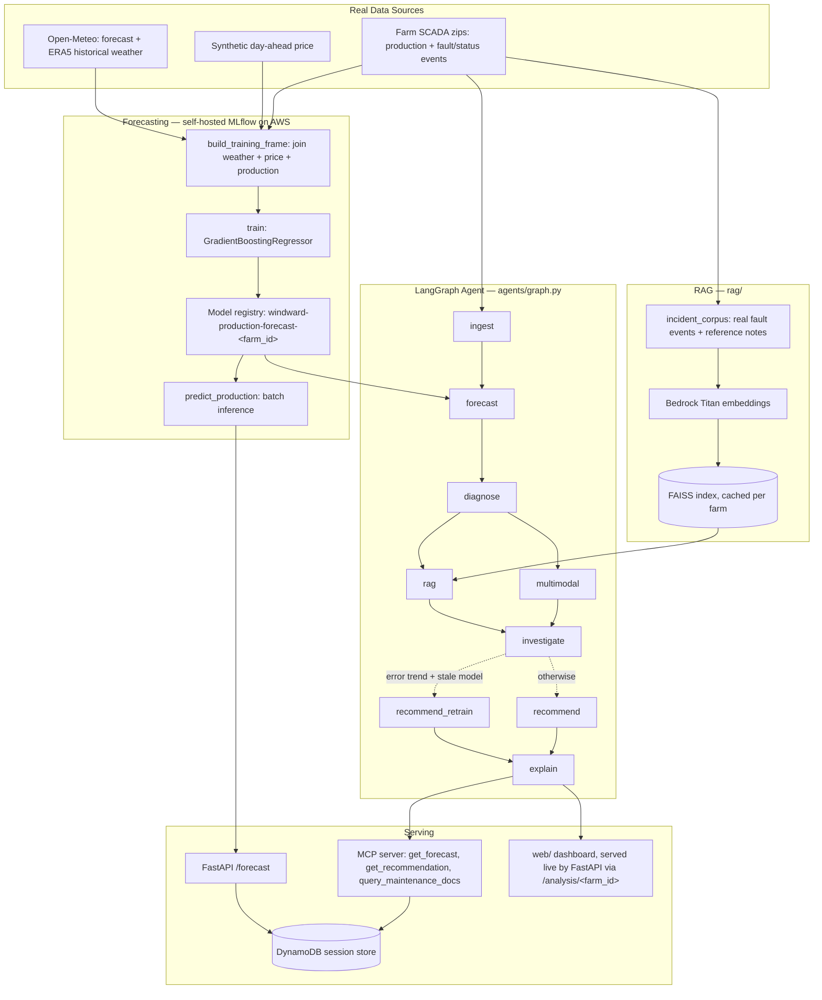
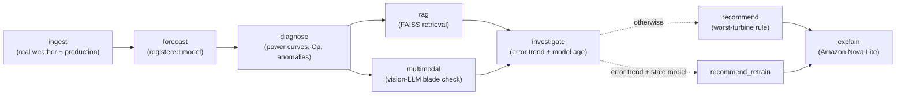

# 🌬️ Windward — Wind Farm Power Prediction

> **Live:** [windward.forwardforecasting.eu](https://windward.forwardforecasting.eu/) — a real, persistently-running FastAPI service on AWS. A multi-agent AI system for wind farm production forecasting and operations support: classic ML forecasting tracked with self-hosted **MLflow**, a **LangGraph** agent workflow for diagnosis and recommendations, **two independent RAG stacks** (LangChain/FAISS + LlamaIndex) over real turbine data, a **multimodal** vision-LLM blade-inspection pass, and real **DynamoDB** session persistence — exposed via a **FastAPI** service and an **MCP server** so the agent's tools are callable from Claude or any MCP client.

**Status:** end-to-end on **real data**, three farms, running as a real AWS service — real historical weather (Open-Meteo) joined with real turbine production (Kelmarsh + Penmanshiel + Hill of Towie open SCADA datasets, two different export formats), per-farm models trained and registered in a self-hosted MLflow registry (S3-backed). The full LangGraph agent runs for any farm: ingest → forecast → diagnose (physics-based efficiency + anomaly detection) → RAG (real fault-event corpus, Bedrock Titan embeddings, FAISS) → multimodal (real vision-LLM blade check) → investigate (real forecast-error-trend + model-age check, conditionally routing to a retrain recommendation) → recommend/recommend_retrain → explain (Amazon Nova Lite), every run persisted to DynamoDB. Dashboard: **[windward.forwardforecasting.eu](https://windward.forwardforecasting.eu/)** (one tab per farm, real charts, and a live "ask the agent" box — a real tool-calling agent (`agents/qa_agent.py`) that decides per question whether it needs the RAG-grounded maintenance corpus, the farm's current analysis, both, or neither, instead of one stuffed prompt). A fourth tab, **EDP Wind Farm A**, adds real labeled fault case studies (diagnosis/RAG only, no forecasting — see §5). A fifth tab, **Wind Prediction**, is a separate time-series-forecasting breadth showcase - naive baselines through a genuine zero-shot foundation-model forecast (§13) - plus the one part of this project that refreshes live rather than from a frozen SCADA snapshot: real-time Open-Meteo weather. Write-up: **[Teaching an Agent to Read Wind Farms](https://education.forwardforecasting.eu/windward-agent/)**.

**Started as a deliberate skill demonstration** (Azure MLflow, RAG, agentic workflows, MLOps — see §2), then pivoted toward becoming an actual product: migrated off Azure onto AWS (see §12), now deployed as a persistent service, with plans to combine it with an energy-price-prediction model and commercialize both. A separate, simpler project will pick up the Azure MLflow demonstration going forward.

**Exercises:** LangChain · LangGraph (including conditional routing) · RAG · LlamaIndex · Semantic Search · MCP servers · REST APIs (FastAPI) · Pydantic · LiteLLM · Langfuse · Multimodal LLMs · DynamoDB · MLflow · generative AI workflow architecture · classical/state-space time-series forecasting (statsmodels) · deep learning & attention forecasters (PyTorch) · zero-shot time-series foundation models (Chronos). (Not LangSmith - Langfuse already covers the observability role; adding a second tracing stack would be a second external account for no functional gain.)

---

## Table of Contents

1. [Project Overview](#1-project-overview)
2. [Skill → Component Map](#2-skill--component-map)
3. [Architecture & Data Flow](#3-architecture--data-flow)
4. [Agent Workflow](#4-agent-workflow)
5. [Data Sources](#5-data-sources)
6. [Data Processing Pipeline](#6-data-processing-pipeline)
7. [Libraries & AI Technologies](#7-libraries--ai-technologies)
8. [Forecasting Model](#8-forecasting-model)
9. [Project Structure](#9-project-structure)
10. [Setup](#10-setup)
11. [Roadmap](#11-roadmap)
12. [Cost & Resource Consumption](#12-cost--resource-consumption)
13. [Wind Prediction: Time-Series Forecasting Showcase](#13-wind-prediction-time-series-forecasting-showcase)

---

## 1. Project Overview

Windward forecasts wind farm energy production and pairs the forecast with an agentic layer that explains it, flags anomalies, and recommends actions (e.g. turbine inspection, curtailment cross-checks) in natural language. It ingests real meteorological data and real turbine SCADA production, trains and tracks forecasting models through a self-hosted MLflow tracking server, and orchestrates a multi-step reasoning workflow on top with LangGraph — served persistently as a real API at [windward.forwardforecasting.eu](https://windward.forwardforecasting.eu/).

The split is deliberate: forecasting is a numerical ML problem (best solved with a regression model, tracked and versioned like any ML project); the agent layer is where an LLM adds value — turning a forecast + anomaly signal into a grounded, explainable recommendation, using retrieval over real documents (a real turbine fault-event log, not hallucinated domain knowledge).

## 2. Skill → Component Map

| Skill | Where it lives |
|---|---|
| Architect generative AI workflows | `agents/graph.py` — the LangGraph state machine |
| Build RAG systems | `rag/langchain_retriever.py`, `rag/incident_corpus.py` — retrieval over a real turbine fault-event corpus; `rag/edp_retriever.py`, `rag/edp_incident_corpus.py` — a second, standalone corpus over EDP Wind Farm A's 22 real labeled fault case studies (§5) |
| Integrate LLM APIs | `agents/llm_router.py`, routed through LiteLLM (AWS Bedrock Nova) |
| Build MCP servers | `mcp_server/` — forecast/diagnosis/RAG tools exposed over MCP |
| Build REST APIs | `api/` — FastAPI service |
| DynamoDB | `storage/dynamo_session_store.py` — every agent run persisted as a real session record |
| LangChain | `rag/langchain_retriever.py`, `rag/embeddings.py` — retriever + custom embeddings wrapper |
| LangGraph | `agents/graph.py` — ingest → forecast → diagnose → rag/multimodal → investigate → (conditional) recommend / recommend_retrain → explain |
| Langfuse | `observability/tracing.py`, wired into every graph run via `agents.graph.run()` and into every `agents/llm_router.py` completion call (which the `/ask` agent and `explain_node` both go through) — active now that `LANGFUSE_*` keys are set, see §12 |
| LiteLLM | `agents/llm_router.py` — provider-agnostic model calls |
| Pydantic | `schemas/models.py` — every tool/agent I/O contract |
| LlamaIndex | `rag/llamaindex_index.py` — second, independent RAG stack over turbine spec metadata |
| Multimodal | `multimodal/blade_inspection.py` — real vision-LLM pass (Bedrock Nova, Converse API) on a real inspection photo |
| Semantic Search | `rag/semantic_search.py` — nearest-neighbor search over the real incident corpus |
| MLflow | `forecasting/train.py`, `forecasting/registry.py` — self-hosted tracking server + registry, S3 artifact store (originally Azure ML, migrated — see §12) |
| Time-series forecasting breadth (classical statistical, state-space, DL, attention, foundation models) | `wind_prediction/` - naive to Chronos foundation-model showcase, separate from the production regression model (§13) |

## 3. Architecture & Data Flow



## 4. Agent Workflow

The LangGraph agent (`agents/graph.py`) runs once per farm, in analysis mode over that farm's real SCADA period — this is the only period with real production data to diagnose against. Each node returns only the state keys it changes. `rag` and `multimodal` run as parallel branches after `diagnose`; `investigate` is their fan-in point (it needs both already in state, the same guarantee `recommend` used to rely on directly) and is the only node with conditional outgoing routing — a real `add_conditional_edges` call, not a fixed linear/parallel run every time. Mixing static predecessor edges into a conditional-routing *target* makes both branches fire regardless of the condition (verified empirically while building this), so `recommend`/`recommend_retrain` deliberately have no incoming edges except the conditional one from `investigate`:



| Node | What it does |
|---|---|
| `ingest` | Builds the real training frame (weather + production) and per-turbine hourly series for the farm |
| `forecast` | Loads the farm's registered MLflow model, predicts across the whole period, builds an actual-vs-predicted comparison |
| `diagnose` | Computes per-turbine power curves + efficiency (Cp vs the Betz limit, using each hour's real air density, not a sea-level constant), flags farm-level forecast deviation, quantifies (not just flags) suspected anemometer bias via power-curve-displacement fitting, flags per-turbine/per-hour underperformance against nearest spatial neighbors, and cross-checks farm SCADA wind speed against the independent Open-Meteo reanalysis — see §4.1 and `analysis/efficiency.py` |
| `rag` | Retrieves the most relevant real fault events + reference notes for this farm from its FAISS index |
| `multimodal` | Real vision-LLM inspection pass (Amazon Nova Lite, Bedrock Converse API) on the worst-performing turbine's sample photo |
| `investigate` | Computes the real recent-vs-overall forecast error trend and the registered model's real age (`forecasting.registry.latest_model_info`); decides whether to route to `recommend_retrain` or `recommend` |
| `recommend` | Rule-based: flags the lowest-capacity-factor turbine, cites the RAG sources used |
| `recommend_retrain` | Taken when the last week's forecast error has run meaningfully hotter than the full period's average *and* the registered model is older than a demo-scale staleness threshold — recommends retraining instead, citing the real numbers |
| `explain` | Calls Amazon Nova Lite with the diagnosis + recommendation + investigation + retrieved context, returns a grounded natural-language field report |

### 4.1 `diagnose` in detail — real power-curve-correction methods, not a first pass

The four techniques below (in `analysis/efficiency.py`) are standard practice in real offshore/onshore wind farm SCADA analysis — not something built from scratch, adapted from prior renewable-energy-sector power-curve-correction work — applied here to Windward's own real open datasets:

- **Real per-hour air density.** Cp/Betz-limit physics is density-dependent (`P_wind = 0.5 * rho * A * v^3`); `air_density_kg_m3()` computes it from the farm's real hourly temperature/pressure (ideal gas law) instead of assuming the 1.225 kg/m3 sea-level constant. This alone moved Kelmarsh 5's peak Cp from 0.611 (above the Betz limit) to 0.594 (right at it) — most of the originally "impossible" reading was the density assumption, not the sensor.
- **Power-curve-displacement fitting.** For any turbine still over the Betz limit after the density correction, `fit_power_curve_displacement()` does a least-squares fit of the horizontal (wind-speed-axis) shift between that turbine's observed curve and the farm's own pooled empirical curve (no manufacturer power-curve CSV exists for these open datasets, so the reference is the real farm-mean curve, not a nominal one) — quantifying the suspected anemometer bias in m/s instead of only flagging it.
- **Neighbor-based underperformance detection.** `neighbor_underperformance()` finds each turbine's k nearest neighbors by real coordinates (`load_turbine_static()` — already used by the LlamaIndex RAG stack, now also feeding diagnostics) and flags hours where a turbine produced meaningfully less than its neighbors' median while those neighbors were themselves producing (robust median/std thresholding, not a single farm-level aggregate check). At Kelmarsh this independently corroborates `recommend_node`'s capacity-factor-based pick — Kelmarsh_6 is flagged in 15% of hours, far above the other turbines — via a completely different method.
- **SCADA-vs-reanalysis cross-check.** `scada_reanalysis_wind_check()` compares farm-mean SCADA wind speed against the independent Open-Meteo reanalysis for the same hours — real QC practice (an on-site sensor checked against an independent reference), adapted since these datasets have no second on-site mast.

## 5. Data Sources

Farms live in `data_sources/farms.py` (`FARMS` registry). All three are real, open, CC BY 4.0 SCADA datasets, but not all in the same export format: Kelmarsh and Penmanshiel are Cubico Sustainable Investments' Greenbyte export (`data_sources/greenbyte_scada.py`); Hill of Towie is RES's own historian export, one CSV per signal-group table per month instead of one CSV per turbine (`data_sources/hill_of_towie_scada.py`). Callers use `data_sources.farms.loader_for(farm)` to get the right module rather than importing one directly — see `Farm.data_source`.

| Farm | Turbines | Capacity | Location | Dataset |
|---|---|---|---|---|
| `kelmarsh` | 6x Senvion MM92 | 12.3 MW | Northamptonshire, UK | [Zenodo DOI 10.5281/zenodo.5841834](https://zenodo.org/records/5841834), 2016 (~98MB) |
| `penmanshiel` | 14x Senvion MM82 | 28.7 MW | Scottish Borders, UK | [Zenodo DOI 10.5281/zenodo.5946808](https://zenodo.org/records/5946808), 2016 (~185MB, split by turbine group) |
| `hill_of_towie` | 21x Siemens SWT-2.3-VS-82 | 48.3 MW | Aberdeenshire, Scotland, UK | [Zenodo DOI 10.5281/zenodo.14870023](https://zenodo.org/records/14870023), 2024 only so far (~1GB; the full dataset spans 2016–2024, one ~1-1.6GB zip per year) |

Datasets considered from the same open-SCADA research and excluded, with why: **EDP open dataset** (Mendeley `zjxjnjp3xs`, onshore Portugal — the earlier research pass had mislabeled it as Spain) — real and CC BY 4.0, but discloses no turbine/farm coordinates and no rated power/rotor diameter, which `Farm` requires. **SMARTEOLE** — a wake-steering experiment, not steady farm production. **Aventa AV-7** — a single research turbine, not a farm. **Pedra do Sal / Beberibe** — real coastal farms, but published as SCADA+LiDAR+turbulent-flux NetCDF, a different data model entirely. **Altahullion** — couldn't independently verify this dataset exists under a citable DOI; not added without that.

**CARE to Compare** (Zenodo 10958775) was excluded for the same reason on an earlier pass — 2 of its 3 farms are anonymized with no public coordinates, and its third (Wind Farm A) is the same underlying EDP data. That objection still holds for the *forecasting* pipeline, but doesn't block a diagnosis/RAG-only addition — see below.

### EDP Wind Farm A — diagnosis/RAG only, no forecasting

Added separately from the `FARMS` registry (`data_sources/edp_scada.py`, `rag/edp_incident_corpus.py`, `rag/edp_retriever.py`, `/edp/*` API routes) rather than shoehorned into it: Wind Farm A, from the **CARE-to-Compare** benchmark ([Zenodo doi:10.5281/zenodo.15846963](https://zenodo.org/records/15846963), CC BY-SA 4.0; [Gück et al. 2024](https://doi.org/10.3390/data9120138)), is EDP's own onshore Portugal wind farm — the original edp.com/en/innovation/data "Wind Farm 1" (whose own download links are currently broken on EDP's live site — verified with a real browser, not just curl) — but anonymized: no coordinates, no rated power/rotor diameter, no real calendar timestamps, and power/energy channels are rescaled to a normalized fraction rather than real kW. `Farm` requires real coordinates (for the Open-Meteo weather join) and rated power/rotor diameter (for Cp/capacity-factor), so this dataset can't back `agents/graph.py`'s forecast pipeline — but wind speed and turbine status codes are real and unscaled, and it has something the other three farms don't: **22 real, independently labeled case studies** (11 with a real root-cause description — gearbox failure, generator bearing failure, transformer failure, hydraulic group), each a ~1-year anonymized SCADA window ending in one labeled anomaly or normal event. That's real ground truth for anomaly detection, which is exactly what it's used for: its own RAG corpus (`rag/edp_incident_corpus.py`, same LangChain/FAISS/Bedrock-Titan pipeline as the other farms) and a real binned power curve + operational-status breakdown per case study, served at `/edp/events`, `/edp/events/{id}`, `/edp/ask`, and its own dashboard tab — no forecast, no LangGraph run, no MLflow model.

To reproduce (766MB for just this farm's slice — the full CARE-to-Compare archive is 5.5GB across all three of its farms, two of which don't back this project):
```bash
curl -sL -o /tmp/care.zip "https://zenodo.org/api/records/15846963/files/CARE_To_Compare.zip/content"
unzip "/tmp/care.zip" "CARE_To_Compare/Wind Farm A/*" -d data/edp_wind_farm_a_raw
mv "data/edp_wind_farm_a_raw/CARE_To_Compare/Wind Farm A/datasets" data/edp_wind_farm_a/
rm -rf data/edp_wind_farm_a_raw /tmp/care.zip
```

| Data | Source | Status |
|---|---|---|
| Turbine production (training target) | Per-farm SCADA zips, downloaded to `data/<farm>/` (gitignored). Parsed + resampled to hourly farm-level totals via `load_farm_hourly_production`; per-turbine wind speed + power via `load_turbine_hourly_series`. | **Real.** |
| Turbine fault/status events (RAG corpus) | Same zips' `Status_*.csv` files — real Stop/Warning/Informational event log with codes and messages (e.g. "Low gearbox oil pressure"). Parsed via `load_status_events`. | **Real.** |
| Meteorological (wind speed/direction, pressure, temp) | Open-Meteo — live forecast API + ERA5 historical archive, free, no key | **Real, live.** Historical archive feeds training (`fetch_historical`) for the same period as the SCADA data, at the farm's real coordinates — deliberately independent of the turbines' own anemometers, since that's what's actually available at forecast time. API defaults to km/h — explicitly requested in m/s to match the schema. |
| Day-ahead energy price | ENTSO-E Transparency Platform | Synthetic day/night curve — GB's post-Brexit price data doesn't map cleanly onto ENTSO-E's EU day-ahead product this client targets, and it isn't load-bearing for the forecasting demo. `entsoe-py` client is implemented and works for EU bidding zones if `ENTSOE_API_TOKEN` is set. |
| Turbine spec metadata (LlamaIndex corpus) | Same datasets' `*_WT_static.csv` files — manufacturer, model, hub height, exact per-turbine coordinates, commercial-ops date. Parsed via `load_turbine_static`. | **Real.** |
| Blade inspection photo (multimodal demo) | One real photo, [Wikimedia Commons, CC BY-SA 3.0](https://commons.wikimedia.org/wiki/File:Begutachtung_eines_Rotorblattes.JPG) — a rope-access technician inspecting a turbine blade. Not a live drone feed (not sourced yet), but a real photo run through a real vision-LLM call, not a placeholder. | **Real (single sample).** |

To reproduce:
```bash
curl -L -o data/kelmarsh/Kelmarsh_SCADA_2016.zip "https://zenodo.org/records/5841834/files/Kelmarsh_SCADA_2016_3082.zip?download=1"
curl -L -o data/penmanshiel/Penmanshiel_SCADA_2016_WT01-10.zip "https://zenodo.org/records/5946808/files/Penmanshiel_SCADA_2016_WT01-10_3107.zip?download=1"
curl -L -o data/penmanshiel/Penmanshiel_SCADA_2016_WT11-15.zip "https://zenodo.org/records/5946808/files/Penmanshiel_SCADA_2016_WT11-15_3107.zip?download=1"
curl -L -o data/hill_of_towie/2024.zip "https://zenodo.org/api/records/14870023/files/2024.zip/content"
curl -L -o data/hill_of_towie/Hill_of_Towie_turbine_metadata.csv "https://zenodo.org/api/records/14870023/files/Hill_of_Towie_turbine_metadata.csv/content"
curl -L -o data/hill_of_towie/Hill_of_Towie_alarms_description.csv "https://zenodo.org/api/records/14870023/files/Hill_of_Towie_alarms_description.csv/content"
```

## 6. Data Processing Pipeline

**Training path** (`python -m forecasting.train`, once per farm):

1. `forecasting.pipeline.build_training_frame(farm)`
   - `greenbyte_scada.load_farm_hourly_production(farm.scada_zips)` — parses the raw 10-minute SCADA CSVs from inside the dataset zip(s), resamples to hourly per turbine, clips negative readings to zero, sums across turbines → real farm-level hourly MW.
   - `meteo_client.fetch_historical(lat, lon, start, end)` — pulls real ERA5 historical weather for the *exact* SCADA date range, at the farm's real coordinates.
   - `energy_price_client.synthetic_prices(...)` — a synthetic day/night price curve aligned to the same timestamps (see §5 for why this one isn't real).
   - Joins all three on timestamp, engineers `hour_of_day` and `wind_speed_cubed` (physically motivated — power ∝ v³), drops incomplete rows.
2. `forecasting.train.train(farm_id, df)` — 80/20 split, fits the model, logs params/metrics/model to the self-hosted MLflow server, registers it as `windward-production-forecast-<farm_id>`.

**Inference path** (`POST /forecast`):

3. `forecasting.predict.predict_production(farm_id, horizon_hours)` — pulls *live, forward-looking* weather from Open-Meteo's forecast API, builds the same feature set, loads the latest registered model from the MLflow registry, predicts. This is what `windward.forwardforecasting.eu`'s `/forecast` endpoint calls.

**Agent path** (`agents/graph.py`, see §4 for the node-by-node breakdown) — re-derives the training frame plus per-turbine series, runs the registered model across the whole period for an actual-vs-predicted comparison, computes efficiency/anomalies, retrieves grounding context, and narrates a recommendation.

**Live dashboard** (`GET /analysis/{farm_id}`, served by `api/main.py`) - runs the same agent graph directly (in-process, 1-hour cache per farm) and returns the results (daily actual-vs-predicted, per-turbine power curves, efficiency table, anomalies, field report) as JSON, consumed by `web/index.html`. `dashboard/export.py` predates this: it runs the same graph and flattens the same shape of data into a static `dashboard_payload.json`, from the earlier Claude-Artifact era where the dashboard couldn't call a live API. It's not wired into any deploy/cron step anymore - the live site doesn't read from it - so treat it as legacy, run manually if at all.

## 7. Libraries & AI Technologies

Grouped by the AI capability each one supports — only libraries actually used in this project are explained:

**Agentic AI / workflow orchestration**
- **LangGraph** — a state-machine framework for building multi-step agent workflows as a directed graph of nodes sharing typed state. Used for the whole ingest → forecast → diagnose → rag → multimodal → recommend → explain pipeline (§4), instead of one hand-rolled function, so each step is independently testable, composable, and (with a checkpointer, not yet added) resumable.
- **LiteLLM** — a unified completion API that targets different LLM providers (Bedrock, OpenAI, Azure OpenAI, …) by changing only a model string. Used in `agents/llm_router.py` so the agent code isn't hard-wired to one vendor's SDK, even though only Bedrock Nova is actually wired up today.

**Retrieval-Augmented Generation (RAG) & embeddings**
- **LangChain** (`langchain-community`) — supplies the `Document` abstraction and the FAISS vector-store integration used by the retriever (`rag/langchain_retriever.py`).
- **FAISS** (`faiss-cpu`) — Meta's similarity-search library; the actual vector index behind both the RAG retriever and the standalone semantic-search tool. Stores embeddings for the incident/reference corpus and finds nearest neighbors fast, cached to disk per farm so it isn't rebuilt (re-embedded) on every run.
- **Amazon Titan Text Embeddings v2** (via `boto3`, wrapped in a ~15-line custom LangChain `Embeddings` class) — turns each fault-event/reference-note document into a 1024-dim vector for FAISS. Chosen over the chat models because Titan embeddings are invocable on-demand in `eu-west-1` (no inference-profile requirement, unlike the newer Nova chat models — see below).
- **LlamaIndex** (`rag/llamaindex_index.py`) — a second, independent retrieval framework, over a different corpus: structured turbine spec/metadata (manufacturer, hub height, exact coordinates) rather than incident narratives. Needed a small custom `CustomLLM` wrapper too — LlamaIndex's query engine defaults to OpenAI for response synthesis, so without pointing it at the same Bedrock Nova model the rest of the project uses, it would silently require an OpenAI key.

**LLM integration**
- **Amazon Nova Lite** (via LiteLLM/Bedrock) — the generation model behind `explain_node`'s field report. Invoked as `bedrock/eu.amazon.nova-lite-v1:0`, an EU cross-region *inference profile* — a real gotcha hit during development: bare Bedrock model IDs aren't invocable on-demand in `eu-west-1` for this model family, only via a region-prefixed inference profile.
- **Amazon Nova Lite, multimodal** (`multimodal/blade_inspection.py`, direct Bedrock Converse API) — the same model family, called with an image content block instead of text-only, for the blade-inspection vision pass.
- **MCP (Model Context Protocol)** — the open protocol/SDK for exposing tools to LLM clients (Claude and others) in a standard way. `mcp_server/` exposes `get_forecast`, `get_recommendation`, and `query_maintenance_docs` over MCP, so an external agent can operate Windward's capabilities directly rather than only via a bespoke REST call.
- **Amazon Nova Lite, tool-calling agent** (`agents/qa_agent.py`, via LiteLLM/Bedrock) - powers the dashboard's "Ask the agent" box (`POST /analysis/{farm_id}/ask`). The LLM decides per question whether it needs `search_maintenance_docs` (the RAG retriever), `get_current_analysis` (the farm's precomputed numbers), both, or neither, instead of one stuffed prompt. This replaced an earlier design that used Claude's `sample` capability from a client-side Claude Artifact (billed to the *viewer's* own Claude account, no AWS cost) - once the dashboard moved off Artifacts onto a real self-hosted frontend (§9/§12), routing the chat through Windward's own Bedrock backend like everything else made more sense than requiring visitors to have a Claude account.

**Observability**
- **Langfuse** (`observability/tracing.py`) - **live and working**, tracing every LLM/agent call end to end: both `explain_node`'s narration inside `agents/graph.py` and `agents/qa_agent.py`'s tool-calling `/ask` loop show up as real traces in the Langfuse dashboard, auto-activating whenever `LANGFUSE_PUBLIC_KEY`/`SECRET_KEY` are set (no-op otherwise). Two coverage paths, because Windward has two different call shapes to trace: `get_handler()` returns a `langfuse.langchain.CallbackHandler` for the LangGraph run (`agents.graph.run()` passes it in as a LangChain callback); `wrap_completion()` wraps `agents/llm_router.py`'s raw `litellm.completion()` calls with a manual Langfuse generation span, for the `/ask` loop's direct calls that don't go through a LangChain `Runnable` at all. The manual path is deliberate, not incidental: litellm's own built-in `success_callback=["langfuse"]` hook is broken against the current Langfuse v4 SDK (`AttributeError: module 'langfuse' has no attribute 'version'`, still true on litellm 1.101.0 as of this writing) and - because litellm swallows that error as "non-blocking" while it actually aborts the completion - was silently degrading every `/ask` question to its stuffed-prompt fallback before this was caught. `wrap_completion()`'s direct `langfuse.get_client().start_as_current_observation()` call sidesteps that broken litellm code path entirely, so it isn't exposed to whichever litellm version happens to be installed.

**MLOps**
- **MLflow** — the open-source experiment-tracking/model-registry standard. Self-hosted here: a small systemd service on the same EC2 as the app, SQLite backend store, S3 artifact store. Every training run's params/metrics/model artifact is logged and versioned, per farm.
- **boto3** — used both for the MLflow server's S3 artifact access and for every AWS call the app makes (Bedrock, DynamoDB). Auth throughout is the EC2 instance's IAM role, picked up automatically from instance metadata — no static keys anywhere.

**Classic ML & data**
- **scikit-learn** — supplies `GradientBoostingRegressor` for production forecasting (§8), plus the train/test split and MAE/R² metrics.
- **pandas** — all the time-series joining/resampling (SCADA → hourly, weather ↔ production ↔ price alignment).
- **Pydantic** — defines every typed contract in the project (`schemas/models.py`): weather/price/production records, forecast requests/results, tool I/O. This is the "structured output" discipline that matters once an LLM is in the loop — it constrains what the agent's tools can actually accept or return, rather than passing loose dicts around.

**Serving**
- **FastAPI** + **uvicorn** — FastAPI is a Python web framework built on type hints and Pydantic for automatic request/response validation; uvicorn is the ASGI server that runs it. Chosen (over Flask/Django) specifically because it reuses the same Pydantic schemas already defined for the agent's tools, so the REST layer and the agent layer never disagree on shape.

**Deliberately not used:** Kafka and GraphQL don't fit this project's shape (batch/agent-run workloads, not event streaming or a graph-shaped API surface) and aren't part of the stack.

## 8. Forecasting Model

**Model:** `sklearn.ensemble.GradientBoostingRegressor`, one instance trained per farm.

### How weather becomes a power prediction - no theoretical power curve involved

There's no manufacturer power-curve lookup table anywhere in this path, and no per-turbine
physics simulation. `forecasting.pipeline.build_training_frame` (§6) joins real historical
weather for the farm's coordinates against that same farm's real historical SCADA production,
hour for hour, and `GradientBoostingRegressor` learns the mapping between them directly from
that correlation: *for this wind speed, temperature/pressure (→ air density), and wind
direction, this farm has historically produced about this much power.* That's the entire
mechanism - an empirical, farm-level power curve learned from real operating data, not a
theoretical one.

That's a real, deliberate advantage over a theoretical curve, not just a simplification:
- **It's the whole farm, not one isolated turbine.** A manufacturer power curve describes a
  single turbine in undisturbed flow. `wind_direction_deg` is in the feature set specifically
  because wake losses (upstream turbines shadowing downstream ones) depend on direction relative
  to the farm's actual layout - something no single-turbine curve can express, and something the
  model can only pick up because it's trained on the real, multi-turbine SCADA total.
- **It's what the farm actually delivered, not what it could physically produce.** SCADA
  production isn't filtered to exclude maintenance stoppages or grid-curtailment events (§6, §4.1)
  before it becomes the training target - `greenbyte_scada.load_farm_hourly_production` clips
  negative readings to zero and nothing else. So the learned relationship blends true
  weather-driven output with however often *this farm, historically,* was down for maintenance or
  curtailed under those conditions. For a forecast that's actually used to bid into a market (§1),
  that's the right thing to predict - a trader cares what the farm will really deliver, not its
  nameplate potential under ideal availability.
- **The trade-off, stated plainly:** this bakes in the training period's maintenance/curtailment
  pattern as if it will repeat. If grid capacity is added and a curtailment pattern that used to
  recur at high wind speed from a particular direction goes away, the model won't know that until
  it's retrained on data from after the change - exactly the kind of concept drift §13's
  monitoring section (and `agents/graph.py`'s `investigate_node`) is watching for.

**Why this model (the algorithm choice):** the problem is tabular regression — a handful of physically meaningful features (wind speed, its cube, direction, temperature, pressure, real air density, price, hour-of-day — `forecasting/features.py`) predicting a continuous target (farm MW output) — on a moderate dataset (a few thousand hourly rows per farm). Gradient-boosted trees are a strong, well-understood default for exactly this shape of problem: they usually match or beat deep learning here with far less tuning and no GPU — training takes seconds on a small EC2 instance, no dedicated compute cluster needed. Validated with 5-fold CV in addition to the single held-out test split (`forecasting/train.py`) — a lower-variance read on generalization than either alone; per-farm k-fold mean test R² lands within ~0.01-0.02 of the single-split R² for all three farms, no sign the original split was lucky or unlucky.

**Strengths for this specific problem:**
- Captures the non-linear cubic relationship between wind speed and power, and interaction effects (e.g. wind speed × time-of-day), without manual feature crosses.
- Robust to the mixed feature scales present (m/s, degrees, hPa, EUR/MWh) — no normalization step needed.
- Robust to noisy/outlier-heavy targets: a *recurring* curtailment/downtime pattern gets learned as part of the farm's effective power curve (see above), but a one-off fault at an otherwise-windy hour is exactly the kind of single-point outlier tree ensembles don't overfit to the way a linear model would.
- Feature importances give a cheap sanity check that the model is actually leaning on wind speed, not spurious correlations.

**Configuration** (`forecasting/train.py`):
```python
GradientBoostingRegressor(n_estimators=200, max_depth=4, learning_rate=0.05, random_state=42)
```
80/20 train/test split, evaluated on held-out MAE (MW) and R².

### Inputs & output

**Inputs** (`forecasting/features.py`'s `FEATURE_COLUMNS`, one row per farm per hour) - the same 8 columns both `forecasting/train.py` (training) and `forecasting/predict.py` (inference) read, so the two paths can't compute a feature differently by accident:

| Feature | Units | What it captures |
|---|---|---|
| `wind_speed_ms` | m/s | primary driver of output |
| `wind_speed_cubed` | (m/s)³ | kinetic power in wind scales with v³ - a physics-motivated nonlinear feature, not left for the model to rediscover |
| `wind_direction_deg` | degrees | wake effects / terrain sheltering depend on direction, not just speed |
| `temperature_c` | °C | drives real air density (below); also a raw weather signal |
| `pressure_hpa` | hPa | drives real air density (below) |
| `air_density_kg_m3` | kg/m³ | computed from `temperature_c`/`pressure_hpa` via the ideal gas law (`analysis/efficiency.air_density_kg_m3`), instead of assuming the 1.225 kg/m³ sea-level constant - see §4.1 |
| `price_eur_mwh` | €/MWh | not a physical driver of output, but lets the model (and the business layer) reason jointly about production and its market value |
| `hour_of_day` | 0-23 | diurnal patterns in both price and, weakly, wind regime |

All 8 come from forecastable sources (Open-Meteo weather forecast + day-ahead price), never from the turbines' own on-site sensors - those aren't available ahead of time, so using them would make this a fit exercise, not a real forecast.

**Output:** `output_mw` - the farm's total hourly electricity production in megawatts, summed across every turbine in the farm (not per-turbine). One value predicted per hour, for however many hours ahead the caller requests (`ForecastRequest.horizon_hours`, up to 168h via `POST /forecast`).

### Why MAE and R², specifically

- **MAE (Mean Absolute Error)** - the mean of `|actual - predicted|` across every held-out hour, in MW (the same units as the target itself). Concretely: Kelmarsh's 1.06 MW MAE means the forecast is off by about 1.06 MW per hour on average, against a farm rated at 12.3 MW. Chosen because it's the number that translates directly into the business metric that actually matters here - the imbalance-cost proxy in §1/§13 is built by multiplying absolute error by price, not a squared or dimensionless error - and because it weighs every hour's miss linearly, so it isn't dominated by the rare large residual the way a squared-error metric (RMSE) would be.
- **R² (coefficient of determination)** - `1 - (sum of squared residuals / total variance of the target)`: how much of the hour-to-hour variance in output the model explains. 1.0 is a perfect fit, 0.0 is no better than always predicting the training mean, negative is worse than that. Kelmarsh's R²=0.73 means the model accounts for 73% of that farm's real output variance. Chosen because it's scale-free, so it's the metric that's actually comparable *across* farms of very different rated capacity (Kelmarsh 12.3 MW vs. Hill of Towie 48.3 MW) - a raw MAE alone can't tell you whether a model is doing a relatively better or worse job once farm size differs, and R² can.

Neither is used blind: `demo_notebook/`'s own case study (§4-5 there) shows R² computed from a random train/test split reads meaningfully higher than the same model's R² from a chronological split - a random split leaks every season into both sides and overstates real forward-looking accuracy - which is exactly the kind of thing a single headline metric can hide.

**Results, held-out test set:**

| Farm | MAE | R² |
|---|---|---|
| Kelmarsh | 1.06 MW | 0.73 |
| Penmanshiel | 1.98 MW | 0.81 |
| Hill of Towie | 4.29 MW | 0.74 |

These are meaningfully harder, more honest numbers than an early synthetic-production prototype's R² 0.95 — real SCADA carries wake effects, curtailment, and downtime the model has to learn around, which is the actual point of using real data.

## 9. Project Structure

```
windward/
├── agents/            # LangGraph workflow + node agents, LiteLLM router
├── analysis/           # physics: power-curve binning, Cp/Betz efficiency
├── data_sources/        # meteo / price / SCADA clients, farm registry, edp_scada.py (§5)
├── forecasting/          # feature engineering, training, registry, prediction
├── rag/                   # LangChain retriever, embeddings, incident corpus, semantic search
├── multimodal/             # blade inspection vision pipeline (real vision-LLM pass, §7)
├── mcp_server/              # MCP tool server
├── api/                      # FastAPI service — this is what runs at windward.forwardforecasting.eu
├── schemas/                   # Pydantic models (tool I/O contracts)
├── observability/               # Langfuse tracing, wired into every graph run (§2)
├── storage/                       # DynamoDB session store
├── dashboard/                      # legacy static-payload export (§6) - superseded by the live GET /analysis/{farm_id}
├── wind_prediction/                 # naive -> foundation-model time-series showcase (§13), separate from forecasting/
├── Dockerfile / docker-compose.prod.yml  # the persistent deployment (§12)
├── web/                               # static dashboard served by the FastAPI app at windward.forwardforecasting.eu
├── infra/
│   ├── aws/                            # the live deployment — what's actually running, and how to reproduce it
│   └── azure/                          # Azure ML setup notes (historical — the account has been decommissioned)
├── tests/
└── docs/
    └── ARCHITECTURE.md
```

## 10. Setup

```bash
python -m venv .venv && source .venv/bin/activate
pip install -r requirements.txt
cp .env.example .env   # fill in AWS region / MLflow tracking URI
```

Runs against a self-hosted MLflow server (`MLFLOW_TRACKING_URI`, defaults to `http://127.0.0.1:5000`) and picks up AWS credentials from the environment — an EC2 instance role in production, or your own AWS CLI profile locally. No Azure account needed anymore.

## 11. Roadmap

- [x] Data source clients (meteo, price) + Pydantic schemas
- [x] Real production data — Kelmarsh + Penmanshiel + Hill of Towie open SCADA datasets
- [x] Baseline forecasting model, MLflow experiment tracking, per-farm registered models (§8)
- [x] Batch inference + FastAPI `/forecast` endpoint
- [x] LangGraph agent, all 9 nodes real (§4), including a real conditional-routing node (`investigate` → `recommend` or `recommend_retrain`)
- [x] Multi-farm support — farm registry + per-farm loader dispatch (`data_sources.farms.loader_for`), now spanning two different SCADA export formats (Greenbyte, RES historian); three farms live (Kelmarsh, Penmanshiel, Hill of Towie), each trained, registered, and served through the full agent
- [x] RAG corpus — real turbine fault/status events + reference notes, Bedrock Titan embeddings, FAISS per farm
- [x] Semantic search — same FAISS index, direct similarity search
- [x] MCP server — `get_forecast`, `get_recommendation`, `query_maintenance_docs` all implemented
- [x] Dashboard — **[windward.forwardforecasting.eu](https://windward.forwardforecasting.eu/)**, served directly by the FastAPI app (`web/`): per-farm tabs, real charts, Betz-limit efficiency table, vision-LLM blade inspection, and a live "ask the agent" box backed by a real tool-calling agent. Started as a Claude Artifact (the only way to get an interactive AI feature inside a sandboxed page that can't call external APIs), moved to a real self-hosted frontend once the project stopped being a portfolio piece and started being a service
- [x] `/ask` wired to a real tool-calling agent (`agents/qa_agent.py`) instead of one stuffed prompt — the LLM decides per question whether it needs `search_maintenance_docs` (the same LangChain/FAISS RAG retriever the MCP server already used, now also reachable from the public dashboard), `get_current_analysis` (the farm's precomputed numeric analysis), both, or neither; falls back to the old stuffed-prompt behavior if tool-calling ever errors. The dashboard shows which source(s) grounded each answer. Traced to Langfuse via `agents/llm_router.py`'s `wrap_completion()`, applied whenever keys are set
- [x] `investigate` node + conditional retrain routing — real recent-vs-overall forecast-error trend (from the same `comparison` DataFrame `diagnose` already produces) and the registered model's real age (`forecasting.registry.latest_model_info`, via `MlflowClient.search_model_versions`) decide whether the graph routes to `recommend_retrain` (cites the real MAPE numbers and model age) or the existing `recommend`. Verified against the real compiled graph with both a fresh-model and a stale-model+degraded-error case
- [x] LlamaIndex — second, independent RAG stack (`rag/llamaindex_index.py`) over real turbine spec metadata (manufacturer, hub height, exact coordinates), a different framework and a different corpus shape from the LangChain/FAISS incident-log stack. Verified: correctly answers "what is the hub height of Kelmarsh 3?" (68.5m, matches the source CSV) and cross-farm elevation comparisons
- [x] Langfuse tracing — **live**, keys set 2026-09-15. `observability/tracing.py` (updated for the current Langfuse v4 API — `langfuse.langchain.CallbackHandler`, not the old `langfuse.callback` path) wired into every graph run via `agents.graph.run()`, plus `wrap_completion()` for `agents/llm_router.py`'s raw `litellm.completion()` calls (which the `/ask` agent and `explain_node` both go through), applied whenever `LANGFUSE_*` keys are set. Not litellm's own built-in `success_callback=["langfuse"]` — that's broken against Langfuse v4 (`AttributeError: module 'langfuse' has no attribute 'version'`, confirmed still broken on litellm 1.101.0) and was silently degrading every `/ask` call to its stuffed-prompt fallback; caught this live once keys were added, fixed by instrumenting manually via `langfuse.get_client().start_as_current_observation()` instead. Verified: a real `windward-complete` GENERATION trace confirmed via the Langfuse API after a live `/ask` call
- [x] Multimodal blade-inspection node — real vision-LLM call (Amazon Nova Lite via the Bedrock Converse API) against a real, openly-licensed inspection photo ([Wikimedia Commons, CC BY-SA 3.0](https://commons.wikimedia.org/wiki/File:Begutachtung_eines_Rotorblattes.JPG)), wired into `multimodal_node` and folded into the field-report narrative
- [x] DynamoDB session store — every non-cached run of the live `/analysis/{farm_id}` endpoint (and any manual `dashboard/export.py` run) writes a real session record (farm, timestamp, mean capacity factor, recommendation, model metrics) via `storage/dynamo_session_store.py`; verified with a live `aws dynamodb scan`
- [x] Explanatory write-up — **[Teaching an Agent to Read Wind Farms](https://education.forwardforecasting.eu/windward-agent/)**, self-hosted (not just a Claude Artifact), listed on the **[Field Notes](https://education.forwardforecasting.eu/)** blog index
- [x] Real power-curve-correction methods in `diagnose` (§4.1) — real per-hour air density (not a sea-level constant) in the Cp/Betz-limit calc, least-squares power-curve-displacement fitting to quantify suspected anemometer bias, KD-tree neighbor-turbine underperformance detection (real per-turbine coordinates via `load_turbine_static()`), and a SCADA-vs-independent-reanalysis QC cross-check. All four verified against real data for all three farms; the air-density fix alone moved Kelmarsh 5's peak Cp from above the Betz limit to right at it
- [x] `air_density_kg_m3` added as a forecasting model feature (`forecasting/features.py`, now shared by both the training and inference paths via one `add_derived_features()` helper instead of the same two lines duplicated three times) — all three farms' models retrained and re-registered (v2) with the new 8-feature schema; verified live post-deploy
- [x] 5-fold cross-validation added to `forecasting/train.py` alongside the existing single train/test split (additional MLflow metrics only — same model gets registered either way)
- [x] **Migrated off Azure onto AWS** (§12) — self-hosted MLflow (systemd + SQLite + S3) and the FastAPI+agent service (Docker, host networking) now run persistently on `forwardforecasting-dev`, an existing EC2 instance (its idle-shutdown automation was disabled so this stays up). Live at **[windward.forwardforecasting.eu](https://windward.forwardforecasting.eu/)**, real HTTPS via Let's Encrypt. Verified: both `/health` and `/forecast` respond correctly through the public domain. Auth is the EC2 instance's IAM role — no static AWS keys anywhere.
- [x] Azure account cleanup — `rg-windward` (the Azure ML workspace and everything it backed) deleted once the AWS replacement was verified working.
- [x] ~~Spain day-ahead price forecasting (`spain_price/`)~~ — added, then removed 2026-09-09: national day-ahead price prediction doesn't belong bundled into a wind-farm-production project whose farms are all in the UK, and it's now its own project, `energy-trader` (real OMIE ingestion, forecasting, backtesting) — see that repo instead.
- [x] **EDP Wind Farm A** — 22 real labeled fault case studies (CARE-to-Compare benchmark, Zenodo 10.5281/zenodo.15846963, CC BY-SA 4.0), diagnosis/RAG only, no forecasting (anonymized: no coordinates, no rated power/rotor diameter — see §5). Own loader, own RAG corpus/retriever, own `/edp/*` API routes and dashboard tab, deliberately kept out of `data_sources.farms.FARMS` rather than forced into the forecast-coupled `agents/graph.py` pipeline. Verified live: real power curve per case study, real status-code breakdown, RAG-grounded Q&A correctly citing the real fault descriptions
- [x] **`wind_prediction/`** - naive to time-series-foundation-model forecasting showcase (§13), one genuinely-executed representative technique per family (SARIMA, Holt-Winters, Kalman-filtered structural time series, VAR, Gradient Boosting, LSTM, a compact Transformer encoder, zero-shot Amazon Chronos-Bolt, and a statistical+ML hybrid), scored on an identical sliding-window backtest; own dashboard tab plus a genuinely live-refreshing Open-Meteo panel
- [ ] Evaluated applying a published statistical power-curve-comparison method (`dswe.ComparePCurve`/`FunGP`, from Yu Ding's *Data Science for Wind Energy* and the [DSWE-Python](https://github.com/TAMU-AML/DSWE-Python) package, MIT license) to upgrade `fit_power_curve_displacement`'s bare least-squares shift with a real significance test — not pursued: the published `dswe` 0.1.3 PyPI release has two real, reproducible bugs against current numpy/scipy (a `grid_size` list-vs-scalar mismatch in `generate_test_set`; a deeper `TypeError` in `_GPMethods.compute_loglike_GP` when scipy's L-BFGS-B passes array-typed values into `math.pow`), confirmed by running it against real Kelmarsh turbine data, not just reading the source. Re-implementing its GP hyperparameter optimizer from scratch inside Windward to work around a third-party package's bugs was judged out of scope; revisit if `dswe` ships a fix
- [ ] Power BI version of the dashboard — moot now the project isn't Azure-hosted; not pursuing further
- [ ] A separate, simpler project to pick up the Azure MLflow skill demonstration

## 12. Cost & Resource Consumption

**Anthropic** is not called by the running system at all — Claude Code was the *development* tool used to build Windward (a separate, development-time cost, not part of this project's runtime bill); the MCP server exposes tools *to* Claude-compatible clients rather than calling Anthropic's API. Everything below is **AWS**, and it's genuinely marginal: the service runs as one more Docker container + one more systemd service on `forwardforecasting-dev`, an EC2 instance already running and already paid for (it hosts `job-hunter-suite` and others). Nothing here required provisioning a new host.

| Category | Resource | Cost |
|---|---|---|
| **Compute** | FastAPI + agent service (Docker, host networking, 700MB memory limit) on the existing EC2 | $0 marginal — the box is already running |
| **Compute** | MLflow tracking server (native systemd service, ~180MB RSS) on the same EC2 | $0 marginal |
| **Storage** | S3 bucket `windward-mlflow-artifacts-ff` (model artifacts, versioned) | Within the AWS always-free tier (5GB/12mo) at this scale; a few cents/month after |
| **Storage** | Raw SCADA data, FAISS/LlamaIndex indexes | $0 — local disk on the EC2, not cloud storage. Hill of Towie's one-year sample (~1GB) is ~5x the size of both Greenbyte farms combined, still trivial on disk |
| **Connectivity** | nginx + Let's Encrypt SSL for `windward.forwardforecasting.eu` | $0 — reuses the existing domain/cert infrastructure |
| **AI services** | Amazon Nova Lite (`explain_node` narration + multimodal vision) | <$0.01/mo at current call volume ($0.06/$0.24 per MTok in/out) |
| **AI services** | Amazon Titan Embeddings v2 (RAG index build, one-time per farm unless the corpus changes) | <$0.001 one-time per farm |
| **AI services** | DynamoDB `windward-agent-sessions` (on-demand billing) | $0 — within the AWS always-free tier (25GB + 25 RCU/WCU) at this scale |

**Estimated total: under $0.10/month, indefinitely.** Auth throughout is the EC2 instance's IAM role (`forwardforecasting-dev-ssm-role`, scoped to exactly this S3 bucket, this DynamoDB table, and the two Bedrock models used) — no static AWS keys anywhere in the codebase or on the server.

### Why AWS, not Azure — the decision that drove the migration

The project's original Azure ML phase was a real, verified skill demonstration (see [infra/azure/README.md](infra/azure/README.md) for exactly what was built and torn down there). Once the goal shifted from "demonstrate Azure MLflow" to "run this as an actual product," splitting a commercial service across two cloud accounts because one half happened to be near-free stopped making sense — it needs one home, on infrastructure already operated day to day.

| Cost category | **Azure ML workspace** | **AWS (existing EC2)** |
|---|---|---|
| Experiment tracking | ~$0.05–0.15/mo flat | Self-hosted MLflow + S3: **~$0/mo** |
| Compute for the API service | Would need a new resource (App Service / container instance) — not already running anywhere on Azure | **$0 marginal** — one more container on a box already running |
| Year 1 / Year 2+ total | Small but nonzero, on infrastructure not otherwise used | **~$0–0.10/mo, both years** |

**The Azure resource group has been deleted** — the account no longer runs anything for this project.

## 13. Wind Prediction: Time-Series Forecasting Showcase

`wind_prediction/` is deliberately separate from `forecasting/`. `forecasting/` answers "what will this farm produce" - a production regression model, tracked/registered/served like any real ML system (§8). `wind_prediction/` answers a different question a lot of energy/wind-sector DS roles specifically screen for: **which time-series forecasting paradigm fits this kind of signal, and why** - a breadth showcase across the field, not a second production candidate. It has its own dashboard tab (**Wind Prediction**, `windward.forwardforecasting.eu`) and its own API routes (`GET /wind-prediction`, `GET /wind-prediction/live-weather`).

### 13.1 Why this needed its own section: static SCADA vs. live meteorological data

Every SCADA dataset this project uses is a frozen, donated historical snapshot - there's no live turbine production feed to refresh daily (see §5's years-covered table below). Weather is the one exception: Open-Meteo's forecast API is genuinely live. The **Live meteorological data** panel on the Wind Prediction tab calls it fresh on every page load (`GET /wind-prediction/live-weather`, `data_sources/meteo_client.fetch_forecast`) - not from any precomputed file - so it's the one part of this whole project that actually refreshes in real time, honestly labeled as such next to the rest of the tab, which is a fixed historical backtest.

| Dataset | Years covered | Refreshable? |
|---|---|---|
| Kelmarsh SCADA | 2016 (Jan 21 – Dec 31) | No - frozen historical donation |
| Penmanshiel SCADA | 2016 (Jun 2 – Dec 31) | No - frozen historical donation |
| Hill of Towie SCADA | 2024 (Jan 1 – Sep 1) | No - frozen historical donation |
| EDP Wind Farm A | 2022-08 – 2023-08 (22 anonymized windows) | No - frozen historical donation |
| **ERA5 / Open-Meteo weather** | Historical archive back to 1940, **plus a live forecast API** | **Yes - genuinely live** |

### 13.2 Technique taxonomy and what's actually implemented

One representative technique per family is genuinely implemented and executed (`wind_prediction/models.py`) - not every named algorithm (e.g. SARIMA stands in for AR/MA/ARMA/ARIMA/SARIMA). The full field taxonomy lives in `wind_prediction/taxonomy.py` (single source of truth for both the README and the dashboard table) and is reproduced here:

| Family | Techniques (field) | Typical use | Implemented & run here |
|---|---|---|---|
| Naive / baseline | Last value, seasonal naive, moving average | Baselines | All three - pure arithmetic on true history, no fitting |
| Classical statistical | AR, MA, ARMA, ARIMA, SARIMA | Stable univariate series | SARIMA(1,1,1)(1,0,0)[24] |
| Exponential smoothing | SES, Holt, Holt-Winters, ETS | Trend/seasonality | Holt-Winters (additive trend + daily seasonality) |
| State-space | Kalman filter, structural time series | Dynamic systems, noisy signals | Structural time series (local level + daily seasonal), Kalman-filtered |
| Multivariate statistical | VAR, VECM | Several interacting time series | VAR(6) over [output_mw, wind_speed_ms] |
| Classical ML | Linear/Ridge/Lasso, Random Forest, XGBoost, LightGBM | Forecasting with engineered features | HistGradientBoostingRegressor on lag + weather features, recursive 24h |
| Deep learning | MLP, CNN/TCN, LSTM, GRU | Complex nonlinear temporal patterns | LSTM sequence-to-sequence (72h in → 24h out), PyTorch |
| Attention / Transformer | TFT, Informer, Autoformer, FEDformer, PatchTST | Long-range dependencies | Compact Transformer-encoder forecaster (72h in → 24h out), PyTorch |
| Modern specialized Transformers / foundation models | TimesFM, Chronos, TimeGPT, Moirai, Lag-Llama | General-purpose / zero-shot forecasting | **Amazon Chronos-Bolt (tiny), genuine zero-shot inference - no training at all** |
| Hybrid | Statistical + ML/Deep Learning | Production forecasting | Holt-Winters (trend+seasonal) + HistGradientBoosting on the residuals |

TimeGPT is excluded from execution (paid API, no key here); Moirai/Lag-Llama are heavier multivariate/probabilistic foundation models in the same category as Chronos.

### 13.3 Evaluation protocol

Every technique is scored identically, so the comparison is fair:

- **Target & split:** Kelmarsh hourly farm production (`output_mw`), same **chronological** 80/20 split as `demo_notebook/` - and for the same documented reason: a random split leaks seasons across train/test and overstates real forward-looking accuracy (see the notebook's §5 for the k-fold-vs-chronological gap this caused there too).
- **Task:** 24h-ahead forecasts from non-overlapping windows spanning the whole test period (~68 windows).
- **No leakage:** each window may use real data strictly before its forecast origin (and, for weather-driven models, the true weather *at* the forecast hours - standing in for forecast weather inputs, exactly like `forecasting/pipeline.py`'s production model), never true output values from inside the window, and never another technique's predictions.
- **State updates, not full retraining:** the statsmodels-based techniques (SARIMA, structural time series) condition on each window's true outcome via `.append(refit=False)` before forecasting the next window - cheap and realistic, but not a full walk-forward *retrain*. That's the honest trade-off against a production-grade version of this backtest; noted rather than glossed over.

### 13.4 Results

Run `python -m wind_prediction.evaluate` (or `python -m wind_prediction.export` to also refresh the dashboard payload) to reproduce:

| Technique | Family | MAE (MW) | RMSE (MW) | R² | MAPE |
|---|---|---|---|---|---|
| **Gradient Boosting (recursive)** | Classical ML | **1.264** | **1.728** | **0.696** | 10.6% |
| SARIMA | Classical statistical | 1.992 | 2.627 | 0.296 | 29.1% |
| VAR (output + wind speed) | Multivariate statistical | 2.017 | 2.676 | 0.270 | 26.3% |
| Chronos-Bolt-Tiny (zero-shot) | Foundation model | 2.116 | 2.884 | 0.152 | 22.4% |
| Structural TS (Kalman) | State-space | 2.151 | 2.988 | 0.089 | 24.6% |
| Persistence (last value) | Naive / baseline | 2.152 | 2.995 | 0.086 | 22.8% |
| Holt-Winters (ETS) | Exponential smoothing | 2.153 | 2.991 | 0.087 | 24.6% |
| Hybrid (ETS + GBM residual) | Hybrid | 2.158 | 2.996 | 0.085 | 25.4% |
| Moving average (24h) | Naive / baseline | 2.210 | 2.925 | 0.128 | 21.0% |
| LSTM (seq2seq) | Deep learning | 2.332 | 2.999 | 0.083 | 25.1% |
| Transformer (encoder) | Attention / Transformer | 2.408 | 3.208 | -0.050 | 29.1% |
| Seasonal naive (t-24h) | Naive / baseline | 2.606 | 3.437 | -0.205 | 18.1% |

68 windows, 1,632 evaluated hours, Kelmarsh, 2026-09-17 run.

**Reading the comparison:**
- **Gradient Boosting wins clearly** (MAE 1.26 MW, R² 0.70 - more than 3x the next-best R²), and the *why* is the real lesson: it's the only technique here combining both lag structure (autocorrelation - what just happened) *and* weather features (physics - what's driving output), where every other family gets only one or the other. SARIMA/ETS/UC see their own past values and nothing else; the notebook's production model (`demo_notebook/`) sees weather and nothing else. Combining both isn't a new idea, but the gap here (0.70 vs the next-best 0.30) is a concrete demonstration of why feature combination usually beats a purer, more "principled" single-paradigm model in practice.
- **Classical statistical/state-space models (SARIMA, VAR, structural TS, ETS) cluster together, well above the naive baselines but well below Gradient Boosting** - consistent with using only their own history (VAR: + wind speed) and no other weather signal.
- **The small, briefly-trained DL/Transformer models underperform even simple baselines here** - the Transformer's R² is *negative* (worse than always predicting the test-period mean). This isn't a bug; it's a well-documented, real finding in the time-series literature - small/mid-size deep forecasters routinely lose to much simpler models without substantially more data and tuning than a single-farm demo can offer (see Zeng et al., *"Are Transformers Effective for Time Series Forecasting?"*, AAAI 2023, where a one-layer linear model beats several Transformer variants on comparable benchmarks). Reproducing that finding here, rather than hiding it, is the point of including them.
- **Chronos, zero-shot and with no farm-specific training at all, still beats the structural TS/ETS/Hybrid/persistence baselines** and lands close to SARIMA/VAR - genuinely interesting less for outright accuracy (a tiny zero-shot model on one specific site's turbine curve isn't its strongest case) than for getting into that range with **zero training**, a real preview of why foundation models are attracting attention in forecasting.

### 13.5 What this doesn't claim

This is a demonstrative breadth showcase, not a second production system, and it doesn't pretend otherwise:
- One farm, one year, one train/test split - not the multi-farm, multi-year robustness check `forecasting/` gets before being registered.
- The classical models' `.append(refit=False)` update is a lighter-weight stand-in for a full walk-forward retrain (§13.3).
- The DL/Transformer models are small and trained briefly (CPU, a few dozen epochs) - sized for one farm-year of data and a live demo, not tuned for a leaderboard.
- Chronos runs zero-shot by design - no farm-specific fine-tuning was attempted, which is the whole point of including it, not a shortcut.
