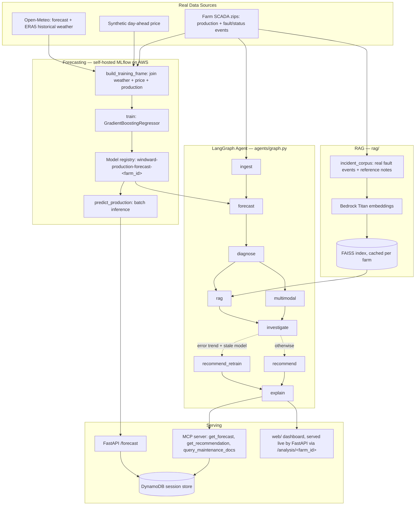
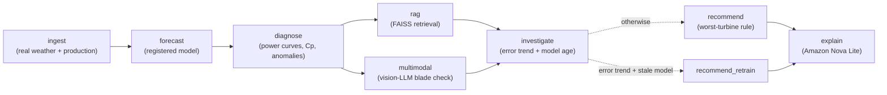
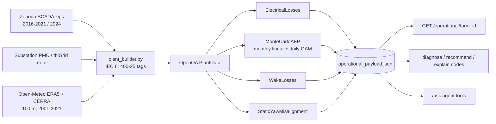

# 🌬️ Windward — Wind Farm Power Prediction

> **Live:** [windward.forwardforecasting.eu](https://windward.forwardforecasting.eu/) — a real, persistently-running FastAPI service on AWS. A multi-agent AI system for wind farm production forecasting and operations support: classic ML forecasting tracked with self-hosted **MLflow**, a **LangGraph** agent workflow for diagnosis and recommendations, **two independent RAG stacks** (LangChain/FAISS + LlamaIndex) over real turbine data, a **multimodal** vision-LLM blade-inspection pass, and real **DynamoDB** session persistence — exposed via a **FastAPI** service and an **MCP server** so the agent's tools are callable from Claude or any MCP client.

**Status:** end-to-end on **real data**, three farms, running as a real AWS service — real historical weather (Open-Meteo) joined with real turbine production (Kelmarsh + Penmanshiel + Hill of Towie open SCADA datasets, two different export formats), per-farm models trained and registered in a self-hosted MLflow registry (S3-backed). The full LangGraph agent runs for any farm: ingest → forecast → diagnose (physics-based efficiency + anomaly detection) → RAG (real fault-event corpus, Bedrock Titan embeddings, FAISS) → multimodal (real vision-LLM blade check) → investigate (real forecast-error-trend + model-age check, conditionally routing to a retrain recommendation) → recommend/recommend_retrain → explain (Amazon Nova Lite), every run persisted to DynamoDB. Dashboard: **[windward.forwardforecasting.eu](https://windward.forwardforecasting.eu/)** (one tab per farm, real charts, and a live "ask the agent" box — a real tool-calling agent (`agents/qa_agent.py`) that decides per question whether it needs the RAG-grounded maintenance corpus, the farm's current analysis, both, or neither, instead of one stuffed prompt). A fourth tab, **EDP Wind Farm A**, adds real labeled fault case studies (diagnosis/RAG only, no forecasting — see §5). A fifth tab, **DSWE Inland-Offshore**, adds a real on-site-met-mast Measure-Correlate-Predict ratio against live Open-Meteo ERA5 (also diagnosis/RAG, also no disclosed location — see §5). A sixth tab, **Wind Prediction**, is a separate time-series-forecasting breadth showcase - naive baselines through a genuine zero-shot foundation-model forecast (§14) - plus the one part of this project that refreshes live rather than from a frozen SCADA snapshot: real-time Open-Meteo weather. Write-up: **[Teaching an Agent to Read Wind Farms](https://education.forwardforecasting.eu/windward-agent/)**.

**Started as a deliberate skill demonstration** (MLflow, RAG, agentic workflows, MLOps — see §2), then pivoted toward becoming an actual product: now deployed as a persistent service on AWS, with plans to combine it with an energy-price-prediction model and commercialize both.

**Exercises:** LangChain · LangGraph (including conditional routing) · RAG · LlamaIndex · Semantic Search · MCP servers · REST APIs (FastAPI) · Pydantic · LiteLLM · Langfuse · Multimodal LLMs · DynamoDB · MLflow · generative AI workflow architecture · classical/state-space time-series forecasting (statsmodels) · deep learning & attention forecasters (PyTorch) · zero-shot time-series foundation models (Chronos). (Not LangSmith - Langfuse already covers the observability role; adding a second tracing stack would be a second external account for no functional gain.)

---

## Table of Contents

1. [Project Overview](#1-project-overview)
2. [Skill → Component Map](#2-skill--component-map)
3. [Architecture & Data Flow](#3-architecture--data-flow)
4. [Agent Workflow](#4-agent-workflow)
5. [Data Sources](#5-data-sources)
6. [Data Processing Pipeline](#6-data-processing-pipeline)
7. [Libraries & AI Technologies](#7-libraries--ai-technologies)
8. [Forecasting Model](#8-forecasting-model)
9. [Blade Inspection](#9-blade-inspection)
10. [Project Structure](#10-project-structure)
11. [Setup](#11-setup)
12. [Roadmap](#12-roadmap)
13. [Cost & Resource Consumption](#13-cost--resource-consumption)
14. [Wind Prediction: Time-Series Forecasting Showcase](#14-wind-prediction-time-series-forecasting-showcase)
15. [Operational Assessment (OpenOA)](#15-operational-assessment-openoa)

---

## 1. Project Overview

Windward forecasts wind farm energy production and pairs the forecast with an agentic layer that explains it, flags anomalies, and recommends actions (e.g. turbine inspection, curtailment cross-checks) in natural language. It ingests real meteorological data and real turbine SCADA production, trains and tracks forecasting models through a self-hosted MLflow tracking server, and orchestrates a multi-step reasoning workflow on top with LangGraph — served persistently as a real API at [windward.forwardforecasting.eu](https://windward.forwardforecasting.eu/).

The split is deliberate: forecasting is a numerical ML problem (best solved with a regression model, tracked and versioned like any ML project); the agent layer is where an LLM adds value — turning a forecast + anomaly signal into a grounded, explainable recommendation, using retrieval over real documents (a real turbine fault-event log, not hallucinated domain knowledge).

## 2. Skill → Component Map

| Skill | Where it lives |
|---|---|
| Architect generative AI workflows | `agents/graph.py` — the LangGraph state machine |
| Build RAG systems | `rag/langchain_retriever.py`, `rag/incident_corpus.py` — retrieval over a real turbine fault-event corpus; `rag/edp_retriever.py`, `rag/edp_incident_corpus.py` — a second, standalone corpus over EDP Wind Farm A's 22 real labeled fault case studies (§5); `rag/dswe_retriever.py`, `rag/dswe_incident_corpus.py` — a third, standalone corpus over the DSWE dataset's real turbine/mast facts and MCP methodology (§5) |
| Integrate LLM APIs | `agents/llm_router.py`, routed through LiteLLM (AWS Bedrock Nova) |
| Build MCP servers | `mcp_server/` — forecast/diagnosis/RAG, OpenOA operational assessment and per-turbine tools exposed over MCP |
| Build REST APIs | `api/` — FastAPI service |
| DynamoDB | `storage/dynamo_session_store.py` — every agent run persisted as a real session record |
| LangChain | `rag/langchain_retriever.py`, `rag/embeddings.py` — retriever + custom embeddings wrapper |
| LangGraph | `agents/graph.py` — ingest → forecast → diagnose → rag/multimodal → investigate → (conditional) recommend / recommend_retrain → explain |
| Langfuse | `observability/tracing.py`, wired into every graph run via `agents.graph.run()` and into every `agents/llm_router.py` completion call (which the `/ask` agent and `explain_node` both go through) — active now that `LANGFUSE_*` keys are set, see §13 |
| LiteLLM | `agents/llm_router.py` — provider-agnostic model calls |
| Pydantic | `schemas/models.py` — every tool/agent I/O contract |
| LlamaIndex | `rag/llamaindex_index.py` — second, independent RAG stack over turbine spec metadata |
| Multimodal | `multimodal/blade_inspection.py` — real vision-LLM pass (Bedrock Nova, Converse API) on a real inspection photo |
| Semantic Search | `rag/semantic_search.py` — nearest-neighbor search over the real incident corpus |
| MLflow | `forecasting/train.py`, `forecasting/registry.py` — self-hosted tracking server + registry, S3 artifact store |
| Wind plant operational assessment (NREL/NLR OpenOA) | `operational_assessment/` - electrical losses, Monte Carlo long-term AEP, wake losses, static yaw misalignment, run offline on the full multi-year data (§15); `analysis/qc.py` - OpenOA's SCADA filters ported into the live `diagnose` step |
| Per-turbine Q&A | `agents/turbine_tools.py` - `get_turbine_details` / `rank_turbines` tools for the `/ask` agent (§15.6) |
| Time-series forecasting breadth (classical statistical, state-space, DL, attention, foundation models) | `wind_prediction/` - naive to Chronos foundation-model showcase, separate from the production regression model (§14) |

## 3. Architecture & Data Flow


```mermaid
flowchart TD
    subgraph Sources [Real Data Sources]
        M[Open-Meteo: forecast + ERA5 historical weather]
        P[Synthetic day-ahead price]
        C[Farm SCADA zips: production + fault/status events]
    end

    subgraph Forecasting [Forecasting — self-hosted MLflow on AWS]
        F1[build_training_frame: join weather + price + production]
        F2[train: GradientBoostingRegressor]
        F3[Model registry: windward-production-forecast-&lt;farm_id&gt;]
        F4[predict_production: batch inference]
    end

    subgraph Agent [LangGraph Agent — agents/graph.py]
        A1[ingest]
        A2[forecast]
        A3[diagnose]
        A4[rag]
        A5[multimodal]
        A6i[investigate]
        A6[recommend]
        A6r[recommend_retrain]
        A7[explain]
    end

    subgraph RAGStack [RAG — rag/]
        R1[incident_corpus: real fault events + reference notes]
        R2[Bedrock Titan embeddings]
        R3[(FAISS index, cached per farm)]
    end

    subgraph Serving
        API[FastAPI /forecast]
        MCP[MCP server: get_forecast, get_recommendation, query_maintenance_docs]
        DASH[web/ dashboard, served live by FastAPI via /analysis/&lt;farm_id&gt;]
        SESS[(DynamoDB session store)]
    end

    M --> F1
    P --> F1
    C --> F1
    F1 --> F2 --> F3
    F3 --> F4 --> API
    F3 --> A2
    C --> A1
    C --> R1 --> R2 --> R3
    R3 --> A4
    A1 --> A2 --> A3 --> A4 --> A6i
    A3 --> A5 --> A6i
    A6i -.->|"error trend + stale model"| A6r
    A6i -.->|"otherwise"| A6
    A6 --> A7
    A6r --> A7
    A7 --> MCP
    A7 --> DASH
    API --> SESS
    MCP --> SESS
```

## 4. Agent Workflow

The LangGraph agent (`agents/graph.py`) runs once per farm, in analysis mode over that farm's real SCADA period — this is the only period with real production data to diagnose against. Each node returns only the state keys it changes. `rag` and `multimodal` run as parallel branches after `diagnose`; `investigate` is their fan-in point (it needs both already in state, the same guarantee `recommend` used to rely on directly) and is the only node with conditional outgoing routing — a real `add_conditional_edges` call, not a fixed linear/parallel run every time. Mixing static predecessor edges into a conditional-routing *target* makes both branches fire regardless of the condition (verified empirically while building this), so `recommend`/`recommend_retrain` deliberately have no incoming edges except the conditional one from `investigate`:


```mermaid
flowchart LR
    ingest["ingest\n(real weather + production)"] --> forecast["forecast\n(registered model)"]
    forecast --> diagnose["diagnose\n(power curves, Cp, anomalies)"]
    diagnose --> rag["rag\n(FAISS retrieval)"]
    diagnose --> multimodal["multimodal\n(vision-LLM blade check)"]
    rag --> investigate["investigate\n(error trend + model age)"]
    multimodal --> investigate
    investigate -.->|error trend + stale model| recommend_retrain["recommend_retrain"]
    investigate -.->|otherwise| recommend["recommend\n(worst-turbine rule)"]
    recommend --> explain["explain\n(Amazon Nova Lite)"]
    recommend_retrain --> explain
```

| Node | What it does |
|---|---|
| `ingest` | Builds the real training frame (weather + production) and per-turbine hourly series for the farm |
| `forecast` | Loads the farm's registered MLflow model, predicts across the whole period, builds an actual-vs-predicted comparison |
| `diagnose` | Computes per-turbine power curves + efficiency (Cp vs the Betz limit, using each hour's real air density, not a sea-level constant), flags farm-level forecast deviation, quantifies (not just flags) suspected anemometer bias via power-curve-displacement fitting, flags per-turbine/per-hour underperformance against nearest spatial neighbors, and cross-checks farm SCADA wind speed against the independent Open-Meteo reanalysis — see §4.1 and `analysis/efficiency.py` |
| `rag` | Retrieves the most relevant real fault events + reference notes for this farm from its FAISS index |
| `multimodal` | Real vision-LLM inspection pass (Amazon Nova Lite, Bedrock Converse API) on the worst-performing turbine's sample photo |
| `investigate` | Computes the real recent-vs-overall forecast error trend and the registered model's real age (`forecasting.registry.latest_model_info`); decides whether to route to `recommend_retrain` or `recommend` |
| `recommend` | Rule-based: flags the lowest-capacity-factor turbine, cites the RAG sources used |
| `recommend_retrain` | Taken when the last week's forecast error has run meaningfully hotter than the full period's average *and* the registered model is older than a demo-scale staleness threshold — recommends retraining instead, citing the real numbers |
| `explain` | Calls Amazon Nova Lite with the diagnosis + recommendation + investigation + retrieved context, returns a grounded natural-language field report |

### 4.1 `diagnose` in detail — real power-curve-correction methods, not a first pass

Before any of them run, every turbine's hourly series goes through **OpenOA-style SCADA QC** (`analysis/qc.py`, §15.2): hours with a frozen anemometer, the turbine stopped in productive wind, or a power-binned wind-speed outlier (derating/curtailment) are removed from everything power-curve-shaped (binned + AMK curves, the displacement fit, peak Cp). Capacity factor and the neighbor check still see every hour, since downtime is exactly what they measure. On Kelmarsh 2016 that removes 5.0% of hours, and lifts the binned curve by up to ~800 kW at 13-16 m/s, where stopped hours (including the pre-commissioning months before the April 2016 COD) had been averaged in. It also settles Kelmarsh 5's Betz-limit reading below: with QC its peak Cp is 0.585, under the 0.593 limit, so the anemometer-suspect anomaly no longer fires for it.

The four techniques below (in `analysis/efficiency.py`) are standard practice in real offshore/onshore wind farm SCADA analysis — not something built from scratch, adapted from prior renewable-energy-sector power-curve-correction work — applied here to Windward's own real open datasets:

- **Real per-hour air density.** Cp/Betz-limit physics is density-dependent (`P_wind = 0.5 * rho * A * v^3`); `air_density_kg_m3()` computes it from the farm's real hourly temperature/pressure (ideal gas law) instead of assuming the 1.225 kg/m3 sea-level constant. This alone moved Kelmarsh 5's peak Cp from 0.611 (above the Betz limit) to 0.594 (right at it) — most of the originally "impossible" reading was the density assumption, not the sensor.
- **Power-curve-displacement fitting.** For any turbine still over the Betz limit after the density correction, `fit_power_curve_displacement()` does a least-squares fit of the horizontal (wind-speed-axis) shift between that turbine's observed curve and the farm's own pooled empirical curve (no manufacturer power-curve CSV exists for these open datasets, so the reference is the real farm-mean curve, not a nominal one) — quantifying the suspected anemometer bias in m/s instead of only flagging it.
- **Neighbor-based underperformance detection.** `neighbor_underperformance()` finds each turbine's k nearest neighbors by real coordinates (`load_turbine_static()` — already used by the LlamaIndex RAG stack, now also feeding diagnostics) and flags hours where a turbine produced meaningfully less than its neighbors' median while those neighbors were themselves producing (robust median/std thresholding, not a single farm-level aggregate check). At Kelmarsh this independently corroborates `recommend_node`'s capacity-factor-based pick — Kelmarsh_6 is flagged in 15% of hours, far above the other turbines — via a completely different method.
- **SCADA-vs-reanalysis cross-check.** `scada_reanalysis_wind_check()` compares farm-mean SCADA wind speed against the independent Open-Meteo reanalysis for the same hours — real QC practice (an on-site sensor checked against an independent reference), adapted since these datasets have no second on-site mast.

## 5. Data Sources

Farms live in `data_sources/farms.py` (`FARMS` registry). All three are real, open, CC BY 4.0 SCADA datasets, but not all in the same export format: Kelmarsh and Penmanshiel are Cubico Sustainable Investments' Greenbyte export (`data_sources/greenbyte_scada.py`); Hill of Towie is RES's own historian export, one CSV per signal-group table per month instead of one CSV per turbine (`data_sources/hill_of_towie_scada.py`). Callers use `data_sources.farms.loader_for(farm)` to get the right module rather than importing one directly — see `Farm.data_source`.

| Farm | Turbines | Capacity | Location | Dataset |
|---|---|---|---|---|
| `kelmarsh` | 6x Senvion MM92 | 12.3 MW | Northamptonshire, UK | [Zenodo DOI 10.5281/zenodo.5841834](https://zenodo.org/records/5841834), 2016 (~98MB) |
| `penmanshiel` | 14x Senvion MM82 | 28.7 MW | Scottish Borders, UK | [Zenodo DOI 10.5281/zenodo.5946808](https://zenodo.org/records/5946808), 2016 (~185MB, split by turbine group) |
| `hill_of_towie` | 21x Siemens SWT-2.3-VS-82 | 48.3 MW | Aberdeenshire, Scotland, UK | [Zenodo DOI 10.5281/zenodo.14870023](https://zenodo.org/records/14870023), 2024 only so far (~1GB; the full dataset spans 2016–2024, one ~1-1.6GB zip per year) |

Datasets considered from the same open-SCADA research and excluded, with why: **EDP open dataset** (Mendeley `zjxjnjp3xs`, onshore Portugal — the earlier research pass had mislabeled it as Spain) — real and CC BY 4.0, but discloses no turbine/farm coordinates and no rated power/rotor diameter, which `Farm` requires. **SMARTEOLE** — a wake-steering experiment, not steady farm production. **Aventa AV-7** — a single research turbine, not a farm. **Pedra do Sal / Beberibe** — real coastal farms, but published as SCADA+LiDAR+turbulent-flux NetCDF, a different data model entirely. **Altahullion** — couldn't independently verify this dataset exists under a citable DOI; not added without that.

**CARE to Compare** (Zenodo 10958775) was excluded for the same reason on an earlier pass — 2 of its 3 farms are anonymized with no public coordinates, and its third (Wind Farm A) is the same underlying EDP data. That objection still holds for the *forecasting* pipeline, but doesn't block a diagnosis/RAG-only addition — see below.

### EDP Wind Farm A — diagnosis/RAG only, no forecasting

Added separately from the `FARMS` registry (`data_sources/edp_scada.py`, `rag/edp_incident_corpus.py`, `rag/edp_retriever.py`, `/edp/*` API routes) rather than shoehorned into it: Wind Farm A, from the **CARE-to-Compare** benchmark ([Zenodo doi:10.5281/zenodo.15846963](https://zenodo.org/records/15846963), CC BY-SA 4.0; [Gück et al. 2024](https://doi.org/10.3390/data9120138)), is EDP's own onshore Portugal wind farm — the original edp.com/en/innovation/data "Wind Farm 1" (whose own download links are currently broken on EDP's live site — verified with a real browser, not just curl) — but anonymized: no coordinates, no rated power/rotor diameter, no real calendar timestamps, and power/energy channels are rescaled to a normalized fraction rather than real kW. `Farm` requires real coordinates (for the Open-Meteo weather join) and rated power/rotor diameter (for Cp/capacity-factor), so this dataset can't back `agents/graph.py`'s forecast pipeline — but wind speed and turbine status codes are real and unscaled, and it has something the other three farms don't: **22 real, independently labeled case studies** (11 with a real root-cause description — gearbox failure, generator bearing failure, transformer failure, hydraulic group), each a ~1-year anonymized SCADA window ending in one labeled anomaly or normal event. That's real ground truth for anomaly detection, which is exactly what it's used for: its own RAG corpus (`rag/edp_incident_corpus.py`, same LangChain/FAISS/Bedrock-Titan pipeline as the other farms) and a real binned power curve + operational-status breakdown per case study, served at `/edp/events`, `/edp/events/{id}`, `/edp/ask`, and its own dashboard tab — no forecast, no LangGraph run, no MLflow model.

To reproduce (766MB for just this farm's slice — the full CARE-to-Compare archive is 5.5GB across all three of its farms, two of which don't back this project):
```bash
curl -sL -o /tmp/care.zip "https://zenodo.org/api/records/15846963/files/CARE_To_Compare.zip/content"
unzip "/tmp/care.zip" "CARE_To_Compare/Wind Farm A/*" -d data/edp_wind_farm_a_raw
mv "data/edp_wind_farm_a_raw/CARE_To_Compare/Wind Farm A/datasets" data/edp_wind_farm_a/
rm -rf data/edp_wind_farm_a_raw /tmp/care.zip
```

### DSWE Inland-Offshore Wind Farm Dataset1 — diagnosis/RAG plus a real Measure-Correlate-Predict ratio

A fifth, non-`FARMS` example, same reasoning as EDP: six real turbines (WT1-WT6) from Yu Ding's *Data Science for Wind Energy* (Chapter 5), each paired with one of three real on-site meteorological masts ([Zenodo doi:10.5281/zenodo.5516552](https://zenodo.org/records/5516552), CC BY 4.0), no disclosed coordinates. Unlike EDP, rows here have no per-row timestamp at all — only a bare sequence number — and the row count for every turbine falls meaningfully short of what continuous 10-minute coverage over the dataset's own documented date range would give (e.g. WT1: 47,542 real rows vs. ~52,704 expected for a full year), so timestamps can't be reconstructed by assuming even spacing either. `data_sources/dswe_scada.py`, `rag/dswe_incident_corpus.py` + `rag/dswe_retriever.py`, `/dswe/*` API routes, own dashboard tab.

What makes this one different from EDP: a real on-site mast reading plus the dataset's own documented real calendar date range (from its Zenodo description, not derived from the timestamp-free rows) is enough to run **Measure-Correlate-Predict (MCP)** — `analysis.efficiency.measure_correlate_predict()` — a standard wind-resource-assessment technique: *Measure* the real mast's mean wind speed over its documented period, *Correlate* it (as a ratio, not a full timestamp-paired regression — the data doesn't support that) against Open-Meteo ERA5's mean for the same real calendar period at a reference location, *Predict* local conditions by scaling ERA5's live forecast by that ratio. The reference location is a real, explicitly illustrative default (Texas Panhandle, USA) the dashboard lets you change — never silently assumed to be the farm's real site, since none is disclosed. The computed ratio (and how far it sits from 1.0) is itself the evidence of how representative that reference point is; switching the dashboard's reference point to, say, New York moves the ratio from 1.62× to 2.51×, which is the point being demonstrated, not hidden.

To reproduce (16MB, small enough to commit directly — see `data/dswe_inland_offshore/`):
```bash
curl -sL -o /tmp/dswe1.zip "https://zenodo.org/api/records/5516552/files/Inland_Offshore_Wind_Farm_Dataset1.zip/content"
unzip -j /tmp/dswe1.zip -d data/dswe_inland_offshore
rm /tmp/dswe1.zip
```

| Data | Source | Status |
|---|---|---|
| Turbine production (training target) | Per-farm SCADA zips, downloaded to `data/<farm>/` (gitignored). Parsed + resampled to hourly farm-level totals via `load_farm_hourly_production`; per-turbine wind speed + power via `load_turbine_hourly_series`. | **Real.** |
| Turbine fault/status events (RAG corpus) | Same zips' `Status_*.csv` files — real Stop/Warning/Informational event log with codes and messages (e.g. "Low gearbox oil pressure"). Parsed via `load_status_events`. | **Real.** |
| Meteorological (wind speed/direction, pressure, temp) | Open-Meteo — live forecast API + ERA5 historical archive, free, no key | **Real, live.** Historical archive feeds training (`fetch_historical`) for the same period as the SCADA data, at the farm's real coordinates — deliberately independent of the turbines' own anemometers, since that's what's actually available at forecast time. API defaults to km/h — explicitly requested in m/s to match the schema. |
| Day-ahead energy price | ENTSO-E Transparency Platform | Synthetic day/night curve — GB's post-Brexit price data doesn't map cleanly onto ENTSO-E's EU day-ahead product this client targets, and it isn't load-bearing for the forecasting demo. `entsoe-py` client is implemented and works for EU bidding zones if `ENTSOE_API_TOKEN` is set. |
| Turbine spec metadata (LlamaIndex corpus) | Same datasets' `*_WT_static.csv` files — manufacturer, model, hub height, exact per-turbine coordinates, commercial-ops date. Parsed via `load_turbine_static`. | **Real.** |
| Substation meter (OpenOA electrical losses + AEP) | Kelmarsh/Penmanshiel: each dataset's `*_PMU_*.zip` (substation power-management unit, `GMS Energy Export (kWh)`, 10-min). Hill of Towie: `tblGrid` station 91's cumulative `ActivePowerExport` counter in the same yearly zip. Parsed by `operational_assessment/plant_builder.py`. The datasets' separate "Grid Meter" device was checked and rejected, see §15.1 | **Real.** |
| Multi-year SCADA (OpenOA only) | Kelmarsh 2016-2021 and Penmanshiel 2016-2021 SCADA zips, ~5.5 GB, used only by the offline OpenOA run, never by the live service | **Real.** |
| Long-term reanalysis (OpenOA AEP/wake) | Open-Meteo archive, hourly 100 m wind + temperature + surface pressure, 2001-2021: ERA5 and CERRA (Copernicus European regional reanalysis) | **Real.** |
| Blade inspection photo (multimodal demo) | One real photo, [Wikimedia Commons, CC BY-SA 3.0](https://commons.wikimedia.org/wiki/File:Begutachtung_eines_Rotorblattes.JPG) — a rope-access technician inspecting a turbine blade. Not a live drone feed (not sourced yet), but a real photo run through a real vision-LLM call, not a placeholder. | **Real (single sample).** |

To reproduce:
```bash
curl -L -o data/kelmarsh/Kelmarsh_SCADA_2016.zip "https://zenodo.org/records/5841834/files/Kelmarsh_SCADA_2016_3082.zip?download=1"
curl -L -o data/penmanshiel/Penmanshiel_SCADA_2016_WT01-10.zip "https://zenodo.org/records/5946808/files/Penmanshiel_SCADA_2016_WT01-10_3107.zip?download=1"
curl -L -o data/penmanshiel/Penmanshiel_SCADA_2016_WT11-15.zip "https://zenodo.org/records/5946808/files/Penmanshiel_SCADA_2016_WT11-15_3107.zip?download=1"
curl -L -o data/hill_of_towie/2024.zip "https://zenodo.org/api/records/14870023/files/2024.zip/content"
curl -L -o data/hill_of_towie/Hill_of_Towie_turbine_metadata.csv "https://zenodo.org/api/records/14870023/files/Hill_of_Towie_turbine_metadata.csv/content"
curl -L -o data/hill_of_towie/Hill_of_Towie_alarms_description.csv "https://zenodo.org/api/records/14870023/files/Hill_of_Towie_alarms_description.csv/content"
```

Extra files only the offline OpenOA run needs (§15):
```bash
for f in Kelmarsh_PMU_3089.zip Kelmarsh_Grid_3088.zip Kelmarsh_SCADA_2017_3083.zip Kelmarsh_SCADA_2018_3084.zip Kelmarsh_SCADA_2019_3085.zip Kelmarsh_SCADA_2020_3086.zip Kelmarsh_SCADA_2021_3087.zip; do
  curl -sL -o data/kelmarsh/$f "https://zenodo.org/api/records/5841834/files/$f/content"; done
for f in Penmanshiel_PMU_3152.zip Penmanshiel_Grid_3153.zip Penmanshiel_SCADA_20{17_WT01-10_3114,17_WT11-15_3115,18_WT01-10_3113,18_WT11-15_3116,19_WT01-10_3112,19_WT11-15_3117,20_WT01-10_3109,20_WT11-15_3118,21_WT01-10_3108,21_WT11-15_3108}.zip; do
  curl -sL -o data/penmanshiel/$f "https://zenodo.org/api/records/5946808/files/$f/content"; done
```

## 6. Data Processing Pipeline

**Training path** (`python -m forecasting.train`, once per farm):

1. `forecasting.pipeline.build_training_frame(farm)`
   - `greenbyte_scada.load_farm_hourly_production(farm.scada_zips)` — parses the raw 10-minute SCADA CSVs from inside the dataset zip(s), resamples to hourly per turbine, clips negative readings to zero, sums across turbines → real farm-level hourly MW.
   - `meteo_client.fetch_historical(lat, lon, start, end)` — pulls real ERA5 historical weather for the *exact* SCADA date range, at the farm's real coordinates.
   - `energy_price_client.synthetic_prices(...)` — a synthetic day/night price curve aligned to the same timestamps (see §5 for why this one isn't real).
   - Joins all three on timestamp, engineers `hour_of_day` and `wind_speed_cubed` (physically motivated — power ∝ v³), drops incomplete rows.
2. `forecasting.train.train(farm_id, df)` — 80/20 split, fits the model, logs params/metrics/model to the self-hosted MLflow server, registers it as `windward-production-forecast-<farm_id>`.

**Inference path** (`POST /forecast`):

3. `forecasting.predict.predict_production(farm_id, horizon_hours)` — pulls *live, forward-looking* weather from Open-Meteo's forecast API, builds the same feature set, loads the latest registered model from the MLflow registry, predicts. This is what `windward.forwardforecasting.eu`'s `/forecast` endpoint calls.

**Agent path** (`agents/graph.py`, see §4 for the node-by-node breakdown) — re-derives the training frame plus per-turbine series, runs the registered model across the whole period for an actual-vs-predicted comparison, computes efficiency/anomalies, retrieves grounding context, and narrates a recommendation.

**Live dashboard** (`GET /analysis/{farm_id}`, served by `api/main.py`) - runs the same agent graph directly (in-process, 1-hour cache per farm) and returns the results (daily actual-vs-predicted, per-turbine power curves, efficiency table, anomalies, field report) as JSON, consumed by `web/index.html`. `dashboard/export.py` predates this: it runs the same graph and flattens the same shape of data into a static `dashboard_payload.json`, from the earlier Claude-Artifact era where the dashboard couldn't call a live API. It's not wired into any deploy/cron step anymore - the live site doesn't read from it - so treat it as legacy, run manually if at all.

## 7. Libraries & AI Technologies

Grouped by the AI capability each one supports — only libraries actually used in this project are explained:

**Agentic AI / workflow orchestration**
- **LangGraph** — a state-machine framework for building multi-step agent workflows as a directed graph of nodes sharing typed state. Used for the whole ingest → forecast → diagnose → rag → multimodal → recommend → explain pipeline (§4), instead of one hand-rolled function, so each step is independently testable, composable, and (with a checkpointer, not yet added) resumable.
- **LiteLLM** — a unified completion API that targets different LLM providers (Bedrock, OpenAI, Azure OpenAI, …) by changing only a model string. Used in `agents/llm_router.py` so the agent code isn't hard-wired to one vendor's SDK, even though only Bedrock Nova is actually wired up today.

**Retrieval-Augmented Generation (RAG) & embeddings**
- **LangChain** (`langchain-community`) — supplies the `Document` abstraction and the FAISS vector-store integration used by the retriever (`rag/langchain_retriever.py`).
- **FAISS** (`faiss-cpu`) — Meta's similarity-search library; the actual vector index behind both the RAG retriever and the standalone semantic-search tool. Stores embeddings for the incident/reference corpus and finds nearest neighbors fast, cached to disk per farm so it isn't rebuilt (re-embedded) on every run.
- **Amazon Titan Text Embeddings v2** (via `boto3`, wrapped in a ~15-line custom LangChain `Embeddings` class) — turns each fault-event/reference-note document into a 1024-dim vector for FAISS. Chosen over the chat models because Titan embeddings are invocable on-demand in `eu-west-1` (no inference-profile requirement, unlike the newer Nova chat models — see below).
- **LlamaIndex** (`rag/llamaindex_index.py`) — a second, independent retrieval framework, over a different corpus: structured turbine spec/metadata (manufacturer, hub height, exact coordinates) rather than incident narratives. Needed a small custom `CustomLLM` wrapper too — LlamaIndex's query engine defaults to OpenAI for response synthesis, so without pointing it at the same Bedrock Nova model the rest of the project uses, it would silently require an OpenAI key.

**LLM integration**
- **Amazon Nova Lite** (via LiteLLM/Bedrock) — the generation model behind `explain_node`'s field report. Invoked as `bedrock/eu.amazon.nova-lite-v1:0`, an EU cross-region *inference profile* — a real gotcha hit during development: bare Bedrock model IDs aren't invocable on-demand in `eu-west-1` for this model family, only via a region-prefixed inference profile.
- **Amazon Nova Lite, multimodal** (`multimodal/blade_inspection.py`, direct Bedrock Converse API) — the same model family, called with an image content block instead of text-only, for the blade-inspection vision pass.
- **MCP (Model Context Protocol)** — the open protocol/SDK for exposing tools to LLM clients (Claude and others) in a standard way. `mcp_server/` exposes `get_forecast`, `get_recommendation`, `query_maintenance_docs`, and (since §15) `get_operational_assessment`, `get_turbine_details` and `rank_turbines` over MCP, so an external agent can operate Windward's capabilities directly rather than only via a bespoke REST call.
- **Amazon Nova Lite, tool-calling agent** (`agents/qa_agent.py`, via LiteLLM/Bedrock) - powers the dashboard's "Ask the agent" box (`POST /analysis/{farm_id}/ask`). The LLM decides per question which tools it needs: `search_maintenance_docs` (the RAG retriever), `get_current_analysis` (the farm's precomputed numbers), `get_operational_assessment` (the OpenOA results, §15), and the per-turbine `get_turbine_details` / `rank_turbines` (§15.6), or none, instead of one stuffed prompt. This replaced an earlier design that used Claude's `sample` capability from a client-side Claude Artifact (billed to the *viewer's* own Claude account, no AWS cost) - once the dashboard moved off Artifacts onto a real self-hosted frontend (§10/§13), routing the chat through Windward's own Bedrock backend like everything else made more sense than requiring visitors to have a Claude account.

**Observability**
- **Langfuse** (`observability/tracing.py`) - **live and working**, tracing every LLM/agent call end to end: both `explain_node`'s narration inside `agents/graph.py` and `agents/qa_agent.py`'s tool-calling `/ask` loop show up as real traces in the Langfuse dashboard, auto-activating whenever `LANGFUSE_PUBLIC_KEY`/`SECRET_KEY` are set (no-op otherwise). Two coverage paths, because Windward has two different call shapes to trace: `get_handler()` returns a `langfuse.langchain.CallbackHandler` for the LangGraph run (`agents.graph.run()` passes it in as a LangChain callback); `wrap_completion()` wraps `agents/llm_router.py`'s raw `litellm.completion()` calls with a manual Langfuse generation span, for the `/ask` loop's direct calls that don't go through a LangChain `Runnable` at all. The manual path is deliberate, not incidental: litellm's own built-in `success_callback=["langfuse"]` hook is broken against the current Langfuse v4 SDK (`AttributeError: module 'langfuse' has no attribute 'version'`, still true on litellm 1.101.0 as of this writing) and - because litellm swallows that error as "non-blocking" while it actually aborts the completion - was silently degrading every `/ask` question to its stuffed-prompt fallback before this was caught. `wrap_completion()`'s direct `langfuse.get_client().start_as_current_observation()` call sidesteps that broken litellm code path entirely, so it isn't exposed to whichever litellm version happens to be installed.

**MLOps**
- **MLflow** — the open-source experiment-tracking/model-registry standard. Self-hosted here: a small systemd service on the same EC2 as the app, SQLite backend store, S3 artifact store. Every training run's params/metrics/model artifact is logged and versioned, per farm.
- **boto3** — used both for the MLflow server's S3 artifact access and for every AWS call the app makes (Bedrock, DynamoDB). Auth throughout is the EC2 instance's IAM role, picked up automatically from instance metadata — no static keys anywhere.

**Wind plant operational analysis**
- **OpenOA** (NREL/NLR, BSD-3-Clause; [Perr-Sauer et al. 2021](https://doi.org/10.21105/joss.02171)) - the open-source reference implementation of the operational assessment methods the wind industry otherwise buys from commercial secondary-SCADA vendors: long-term corrected AEP with Monte Carlo uncertainty, electrical losses, wake losses, static yaw misalignment, all built on a common `PlantData` model with an IEC 61400-25 tag schema. Run **offline in its own venv** (`requirements-openoa.txt`), never imported by the live service, because OpenOA 3.2 pins `scikit-learn<1.7` and its `pygam` dependency pins `scipy<1.17`: installing it into the service would downgrade both and risk the registered MLflow models (trained under scikit-learn 1.9) no longer unpickling. Its results ship as a static JSON payload, the same pattern as `wind_prediction/`. Three of its small SCADA filters are ported into `analysis/qc.py` instead, and verified flag-for-flag identical to OpenOA's own on a 3,000-point test series (`operational_assessment/check_filter_parity.py`). See §15.

**Classic ML & data**
- **scikit-learn** — supplies `GradientBoostingRegressor` for production forecasting (§8), plus the train/test split and MAE/R² metrics.
- **dswe** (`analysis.efficiency.smooth_power_curve`) — a published kernel-regression power-curve method (AMK, Lee et al. 2015) from Yu Ding's *Data Science for Wind Energy*, giving a continuous curve alongside the existing discrete IEC binning. The same package's `ComparePCurve`/`FunGP`/`TempGP` were evaluated and not used — see roadmap (§12).
- **pandas** — all the time-series joining/resampling (SCADA → hourly, weather ↔ production ↔ price alignment).
- **Pydantic** — defines every typed contract in the project (`schemas/models.py`): weather/price/production records, forecast requests/results, tool I/O. This is the "structured output" discipline that matters once an LLM is in the loop — it constrains what the agent's tools can actually accept or return, rather than passing loose dicts around.

**Serving**
- **FastAPI** + **uvicorn** — FastAPI is a Python web framework built on type hints and Pydantic for automatic request/response validation; uvicorn is the ASGI server that runs it. Chosen (over Flask/Django) specifically because it reuses the same Pydantic schemas already defined for the agent's tools, so the REST layer and the agent layer never disagree on shape.

**Deliberately not used:** Kafka and GraphQL don't fit this project's shape (batch/agent-run workloads, not event streaming or a graph-shaped API surface) and aren't part of the stack.

## 8. Forecasting Model

**Model:** `sklearn.ensemble.GradientBoostingRegressor`, one instance trained per farm.

### How weather becomes a power prediction - no theoretical power curve involved

There's no manufacturer power-curve lookup table anywhere in this path, and no per-turbine
physics simulation. `forecasting.pipeline.build_training_frame` (§6) joins real historical
weather for the farm's coordinates against that same farm's real historical SCADA production,
hour for hour, and `GradientBoostingRegressor` learns the mapping between them directly from
that correlation: *for this wind speed, temperature/pressure (→ air density), and wind
direction, this farm has historically produced about this much power.* That's the entire
mechanism - an empirical, farm-level power curve learned from real operating data, not a
theoretical one.

That's a real, deliberate advantage over a theoretical curve, not just a simplification:
- **It's the whole farm, not one isolated turbine.** A manufacturer power curve describes a
  single turbine in undisturbed flow. `wind_direction_deg` is in the feature set specifically
  because wake losses (upstream turbines shadowing downstream ones) depend on direction relative
  to the farm's actual layout - something no single-turbine curve can express, and something the
  model can only pick up because it's trained on the real, multi-turbine SCADA total.
- **It's what the farm actually delivered, not what it could physically produce.** SCADA
  production isn't filtered to exclude maintenance stoppages or grid-curtailment events (§6, §4.1)
  before it becomes the training target - `greenbyte_scada.load_farm_hourly_production` clips
  negative readings to zero and nothing else. So the learned relationship blends true
  weather-driven output with however often *this farm, historically,* was down for maintenance or
  curtailed under those conditions. For a forecast that's actually used to bid into a market (§1),
  that's the right thing to predict - a trader cares what the farm will really deliver, not its
  nameplate potential under ideal availability.
- **The trade-off, stated plainly:** this bakes in the training period's maintenance/curtailment
  pattern as if it will repeat. If grid capacity is added and a curtailment pattern that used to
  recur at high wind speed from a particular direction goes away, the model won't know that until
  it's retrained on data from after the change - exactly the kind of concept drift §14's
  monitoring section (and `agents/graph.py`'s `investigate_node`) is watching for.

**Why this model (the algorithm choice):** the problem is tabular regression — a handful of physically meaningful features (wind speed, its cube, direction, temperature, pressure, real air density, price, hour-of-day — `forecasting/features.py`) predicting a continuous target (farm MW output) — on a moderate dataset (a few thousand hourly rows per farm). Gradient-boosted trees are a strong, well-understood default for exactly this shape of problem: they usually match or beat deep learning here with far less tuning and no GPU — training takes seconds on a small EC2 instance, no dedicated compute cluster needed. Validated with 5-fold CV in addition to the single held-out test split (`forecasting/train.py`) — a lower-variance read on generalization than either alone; per-farm k-fold mean test R² lands within ~0.01-0.02 of the single-split R² for all three farms, no sign the original split was lucky or unlucky.

**Strengths for this specific problem:**
- Captures the non-linear cubic relationship between wind speed and power, and interaction effects (e.g. wind speed × time-of-day), without manual feature crosses.
- Robust to the mixed feature scales present (m/s, degrees, hPa, EUR/MWh) — no normalization step needed.
- Robust to noisy/outlier-heavy targets: a *recurring* curtailment/downtime pattern gets learned as part of the farm's effective power curve (see above), but a one-off fault at an otherwise-windy hour is exactly the kind of single-point outlier tree ensembles don't overfit to the way a linear model would.
- Feature importances give a cheap sanity check that the model is actually leaning on wind speed, not spurious correlations.

**Configuration** (`forecasting/train.py`):
```python
GradientBoostingRegressor(n_estimators=200, max_depth=4, learning_rate=0.05, random_state=42)
```
80/20 train/test split, evaluated on held-out MAE (MW) and R².

### Inputs & output

**Inputs** (`forecasting/features.py`'s `FEATURE_COLUMNS`, one row per farm per hour) - the same 8 columns both `forecasting/train.py` (training) and `forecasting/predict.py` (inference) read, so the two paths can't compute a feature differently by accident:

| Feature | Units | What it captures |
|---|---|---|
| `wind_speed_ms` | m/s | primary driver of output |
| `wind_speed_cubed` | (m/s)³ | kinetic power in wind scales with v³ - a physics-motivated nonlinear feature, not left for the model to rediscover |
| `wind_direction_deg` | degrees | wake effects / terrain sheltering depend on direction, not just speed |
| `temperature_c` | °C | drives real air density (below); also a raw weather signal |
| `pressure_hpa` | hPa | drives real air density (below) |
| `air_density_kg_m3` | kg/m³ | computed from `temperature_c`/`pressure_hpa` via the ideal gas law (`analysis/efficiency.air_density_kg_m3`), instead of assuming the 1.225 kg/m³ sea-level constant - see §4.1 |
| `price_eur_mwh` | €/MWh | not a physical driver of output, but lets the model (and the business layer) reason jointly about production and its market value |
| `hour_of_day` | 0-23 | diurnal patterns in both price and, weakly, wind regime |

All 8 come from forecastable sources (Open-Meteo weather forecast + day-ahead price), never from the turbines' own on-site sensors - those aren't available ahead of time, so using them would make this a fit exercise, not a real forecast.

**Output:** `output_mw` - the farm's total hourly electricity production in megawatts, summed across every turbine in the farm (not per-turbine). One value predicted per hour, for however many hours ahead the caller requests (`ForecastRequest.horizon_hours`, up to 168h via `POST /forecast`).

### Why MAE and R², specifically

- **MAE (Mean Absolute Error)** - the mean of `|actual - predicted|` across every held-out hour, in MW (the same units as the target itself). Concretely: Kelmarsh's 1.06 MW MAE means the forecast is off by about 1.06 MW per hour on average, against a farm rated at 12.3 MW. Chosen because it's the number that translates directly into the business metric that actually matters here - the imbalance-cost proxy in §1/§14 is built by multiplying absolute error by price, not a squared or dimensionless error - and because it weighs every hour's miss linearly, so it isn't dominated by the rare large residual the way a squared-error metric (RMSE) would be.
- **R² (coefficient of determination)** - `1 - (sum of squared residuals / total variance of the target)`: how much of the hour-to-hour variance in output the model explains. 1.0 is a perfect fit, 0.0 is no better than always predicting the training mean, negative is worse than that. Kelmarsh's R²=0.73 means the model accounts for 73% of that farm's real output variance. Chosen because it's scale-free, so it's the metric that's actually comparable *across* farms of very different rated capacity (Kelmarsh 12.3 MW vs. Hill of Towie 48.3 MW) - a raw MAE alone can't tell you whether a model is doing a relatively better or worse job once farm size differs, and R² can.

Neither is used blind: `demo_notebook/`'s own case study (§4-5 there) shows R² computed from a random train/test split reads meaningfully higher than the same model's R² from a chronological split - a random split leaks every season into both sides and overstates real forward-looking accuracy - which is exactly the kind of thing a single headline metric can hide.

**Results, held-out test set:**

| Farm | MAE | R² |
|---|---|---|
| Kelmarsh | 1.06 MW | 0.73 |
| Penmanshiel | 1.98 MW | 0.81 |
| Hill of Towie | 4.29 MW | 0.74 |

These are meaningfully harder, more honest numbers than an early synthetic-production prototype's R² 0.95 — real SCADA carries wake effects, curtailment, and downtime the model has to learn around, which is the actual point of using real data.

## 9. Blade Inspection

A real multimodal-LLM pass that turns the numeric efficiency diagnosis into a first-pass visual
one - finding a plausible *explanation* for turbine underperformance, not just flagging that it's
happening.

**What it does:** after `diagnose` (§4) computes per-turbine efficiency from real SCADA data,
`multimodal_node` (`agents/graph.py`) picks the **worst-performing turbine in the fleet** by
lowest capacity factor - no manual selection, it's driven by the same efficiency numbers
`recommend_node` (§4) builds its own recommendation from - and runs `inspect_image()`
(`multimodal/blade_inspection.py`)
against a real photo of a technician inspecting a turbine blade ([Wikimedia Commons, CC BY-SA
3.0](https://commons.wikimedia.org/wiki/File:Begutachtung_eines_Rotorblattes.JPG); not a live
drone feed per turbine yet, see §12's roadmap). The result surfaces on the dashboard's "Blade
inspection (vision-LLM)" card next to the photo.

**How AI is applied:** a genuine multimodal LLM call, not an image-classification model or OCR -
the raw image bytes and a text prompt go to **Amazon Nova Lite** together, via AWS Bedrock's
Converse API (`boto3`, called directly rather than through LiteLLM - the code comment notes
LiteLLM's Bedrock image support was inconsistent across Nova versions, and Converse's image block
is the officially documented multimodal input path for Nova). The prompt asks Nova to visually
assess the photo for specific damage types (leading-edge erosion, cracks, delamination,
lightning-strike marks, icing) and reply with **only a JSON object** -
`{damage_detected, damage_types, confidence, description}` - which is parsed and validated into a
`BladeInspectionResult` Pydantic model (`schemas/models.py`), not left as free text, so the rest
of the app (dashboard, `explain_node`'s narration) can rely on its shape.

**The honest limitation:** it's the same one sample photo every run, re-labeled with whichever
turbine currently has the worst capacity factor - so today this demonstrates the *mechanism* (a
real vision-LLM call producing a structured damage verdict, triggered by a real data-driven
turbine selection) rather than a genuine per-turbine live inspection pipeline. Wiring it to real
per-turbine drone imagery is explicitly future work, not claimed as done.

## 10. Project Structure

```
windward/
├── agents/            # LangGraph workflow + node agents, LiteLLM router
├── analysis/           # physics: power-curve binning, Cp/Betz efficiency
├── data_sources/        # meteo / price / SCADA clients, farm registry, edp_scada.py + dswe_scada.py (§5)
├── forecasting/          # feature engineering, training, registry, prediction
├── rag/                   # LangChain retriever, embeddings, incident corpus, semantic search
├── multimodal/             # blade inspection vision pipeline (real vision-LLM pass, §7)
├── mcp_server/              # MCP tool server
├── api/                      # FastAPI service — this is what runs at windward.forwardforecasting.eu
├── schemas/                   # Pydantic models (tool I/O contracts)
├── observability/               # Langfuse tracing, wired into every graph run (§2)
├── storage/                       # DynamoDB session store
├── dashboard/                      # legacy static-payload export (§6) - superseded by the live GET /analysis/{farm_id}
├── wind_prediction/                 # naive -> foundation-model time-series showcase (§14), separate from forecasting/
├── operational_assessment/           # offline OpenOA runner (own venv) + the service-side payload reader (§15)
├── Dockerfile / docker-compose.prod.yml  # the persistent deployment (§13)
├── web/                               # static dashboard served by the FastAPI app at windward.forwardforecasting.eu
├── infra/
│   └── aws/                            # the live deployment — what's actually running, and how to reproduce it
├── tests/
└── docs/
    └── ARCHITECTURE.md
```

## 11. Setup

```bash
python -m venv .venv && source .venv/bin/activate
pip install -r requirements.txt
cp .env.example .env   # fill in AWS region / MLflow tracking URI
```

The OpenOA operational assessment (§15) runs offline in a separate venv, then its JSON payload is committed:
```bash
python3 -m venv .venv-openoa && .venv-openoa/bin/pip install -r requirements-openoa.txt
.venv-openoa/bin/python -m operational_assessment.run_openoa            # all farms, or name one
.venv-openoa/bin/python -m operational_assessment.run_openoa --merge    # fold per-farm results into the payload
```

Runs against a self-hosted MLflow server (`MLFLOW_TRACKING_URI`, defaults to `http://127.0.0.1:5000`) and picks up AWS credentials from the environment — an EC2 instance role in production, or your own AWS CLI profile locally.

## 12. Roadmap

- [x] Data source clients (meteo, price) + Pydantic schemas
- [x] Real production data — Kelmarsh + Penmanshiel + Hill of Towie open SCADA datasets
- [x] Baseline forecasting model, MLflow experiment tracking, per-farm registered models (§8)
- [x] Batch inference + FastAPI `/forecast` endpoint
- [x] LangGraph agent, all 9 nodes real (§4), including a real conditional-routing node (`investigate` → `recommend` or `recommend_retrain`)
- [x] Multi-farm support — farm registry + per-farm loader dispatch (`data_sources.farms.loader_for`), now spanning two different SCADA export formats (Greenbyte, RES historian); three farms live (Kelmarsh, Penmanshiel, Hill of Towie), each trained, registered, and served through the full agent
- [x] RAG corpus — real turbine fault/status events + reference notes, Bedrock Titan embeddings, FAISS per farm
- [x] Semantic search — same FAISS index, direct similarity search
- [x] MCP server — `get_forecast`, `get_recommendation`, `query_maintenance_docs` all implemented
- [x] Dashboard — **[windward.forwardforecasting.eu](https://windward.forwardforecasting.eu/)**, served directly by the FastAPI app (`web/`): per-farm tabs, real charts, Betz-limit efficiency table, vision-LLM blade inspection, and a live "ask the agent" box backed by a real tool-calling agent. Started as a Claude Artifact (the only way to get an interactive AI feature inside a sandboxed page that can't call external APIs), moved to a real self-hosted frontend once the project stopped being a portfolio piece and started being a service
- [x] `/ask` wired to a real tool-calling agent (`agents/qa_agent.py`) instead of one stuffed prompt — the LLM decides per question whether it needs `search_maintenance_docs` (the same LangChain/FAISS RAG retriever the MCP server already used, now also reachable from the public dashboard), `get_current_analysis` (the farm's precomputed numeric analysis), both, or neither; falls back to the old stuffed-prompt behavior if tool-calling ever errors. The dashboard shows which source(s) grounded each answer. Traced to Langfuse via `agents/llm_router.py`'s `wrap_completion()`, applied whenever keys are set
- [x] `investigate` node + conditional retrain routing — real recent-vs-overall forecast-error trend (from the same `comparison` DataFrame `diagnose` already produces) and the registered model's real age (`forecasting.registry.latest_model_info`, via `MlflowClient.search_model_versions`) decide whether the graph routes to `recommend_retrain` (cites the real MAPE numbers and model age) or the existing `recommend`. Verified against the real compiled graph with both a fresh-model and a stale-model+degraded-error case
- [x] LlamaIndex — second, independent RAG stack (`rag/llamaindex_index.py`) over real turbine spec metadata (manufacturer, hub height, exact coordinates), a different framework and a different corpus shape from the LangChain/FAISS incident-log stack. Verified: correctly answers "what is the hub height of Kelmarsh 3?" (68.5m, matches the source CSV) and cross-farm elevation comparisons
- [x] Langfuse tracing — **live**, keys set 2026-09-15. `observability/tracing.py` (updated for the current Langfuse v4 API — `langfuse.langchain.CallbackHandler`, not the old `langfuse.callback` path) wired into every graph run via `agents.graph.run()`, plus `wrap_completion()` for `agents/llm_router.py`'s raw `litellm.completion()` calls (which the `/ask` agent and `explain_node` both go through), applied whenever `LANGFUSE_*` keys are set. Not litellm's own built-in `success_callback=["langfuse"]` — that's broken against Langfuse v4 (`AttributeError: module 'langfuse' has no attribute 'version'`, confirmed still broken on litellm 1.101.0) and was silently degrading every `/ask` call to its stuffed-prompt fallback; caught this live once keys were added, fixed by instrumenting manually via `langfuse.get_client().start_as_current_observation()` instead. Verified: a real `windward-complete` GENERATION trace confirmed via the Langfuse API after a live `/ask` call
- [x] Multimodal blade-inspection node — real vision-LLM call (Amazon Nova Lite via the Bedrock Converse API) against a real, openly-licensed inspection photo ([Wikimedia Commons, CC BY-SA 3.0](https://commons.wikimedia.org/wiki/File:Begutachtung_eines_Rotorblattes.JPG)), wired into `multimodal_node` and folded into the field-report narrative
- [x] DynamoDB session store — every non-cached run of the live `/analysis/{farm_id}` endpoint (and any manual `dashboard/export.py` run) writes a real session record (farm, timestamp, mean capacity factor, recommendation, model metrics) via `storage/dynamo_session_store.py`; verified with a live `aws dynamodb scan`
- [x] Explanatory write-up — **[Teaching an Agent to Read Wind Farms](https://education.forwardforecasting.eu/windward-agent/)**, self-hosted (not just a Claude Artifact), listed on the **[Field Notes](https://education.forwardforecasting.eu/)** blog index
- [x] Real power-curve-correction methods in `diagnose` (§4.1) — real per-hour air density (not a sea-level constant) in the Cp/Betz-limit calc, least-squares power-curve-displacement fitting to quantify suspected anemometer bias, KD-tree neighbor-turbine underperformance detection (real per-turbine coordinates via `load_turbine_static()`), and a SCADA-vs-independent-reanalysis QC cross-check. All four verified against real data for all three farms; the air-density fix alone moved Kelmarsh 5's peak Cp from above the Betz limit to right at it
- [x] `air_density_kg_m3` added as a forecasting model feature (`forecasting/features.py`, now shared by both the training and inference paths via one `add_derived_features()` helper instead of the same two lines duplicated three times) — all three farms' models retrained and re-registered (v2) with the new 8-feature schema; verified live post-deploy
- [x] 5-fold cross-validation added to `forecasting/train.py` alongside the existing single train/test split (additional MLflow metrics only — same model gets registered either way)
- [x] **Deployed persistently on AWS** (§13) — self-hosted MLflow (systemd + SQLite + S3) and the FastAPI+agent service (Docker, host networking) run on AWS. Live at **[windward.forwardforecasting.eu](https://windward.forwardforecasting.eu/)**, real HTTPS via Let's Encrypt. Verified: both `/health` and `/forecast` respond correctly through the public domain. Auth is the EC2 instance's IAM role — no static AWS keys anywhere.
- [x] **Migrated from `forwardforecasting-dev` to `forwardforecasting`** (2026-09-18, see `infra/aws/README.md`) — the separate dev box had its idle-shutdown automation disabled to keep windward up persistently, at which point it was just a second always-on EC2 instance costing roughly the same as the main production host, not a cheaper sandbox. Consolidated onto `forwardforecasting` instead: resized it `t3.small` → `t3.medium` first (RAM headroom — both boxes were already swap-constrained at their prior load, confirmed by checking `free -h` before touching anything), moved windward's port from 8000 → 8020 (collision with an unrelated service on the shared box), repointed CI/CD's SSM deploy target and IAM policy at the new instance, then terminated `forwardforecasting-dev` once the migrated service was verified live. `energy-trader` (a sibling project) made the same move at the same time.
- [x] ~~Spain day-ahead price forecasting (`spain_price/`)~~ — added, then removed 2026-09-09: national day-ahead price prediction doesn't belong bundled into a wind-farm-production project whose farms are all in the UK, and it's now a separate, standalone project (real OMIE ingestion, forecasting, backtesting).
- [x] **EDP Wind Farm A** — 22 real labeled fault case studies (CARE-to-Compare benchmark, Zenodo 10.5281/zenodo.15846963, CC BY-SA 4.0), diagnosis/RAG only, no forecasting (anonymized: no coordinates, no rated power/rotor diameter — see §5). Own loader, own RAG corpus/retriever, own `/edp/*` API routes and dashboard tab, deliberately kept out of `data_sources.farms.FARMS` rather than forced into the forecast-coupled `agents/graph.py` pipeline. Verified live: real power curve per case study, real status-code breakdown, RAG-grounded Q&A correctly citing the real fault descriptions
- [x] **`wind_prediction/`** - naive to time-series-foundation-model forecasting showcase (§14), one genuinely-executed representative technique per family (SARIMA, Holt-Winters, Kalman-filtered structural time series, VAR, Gradient Boosting, LSTM, a compact Transformer encoder, zero-shot Amazon Chronos-Bolt, and a statistical+ML hybrid), scored on an identical sliding-window backtest; own dashboard tab plus a genuinely live-refreshing Open-Meteo panel
- [x] **Real CI/CD** (`.github/workflows/deploy.yml`, `infra/aws/README.md`) - `pytest` on every push to `master`, deploy only on green, no SSH keys anywhere (GitHub OIDC to a tightly-scoped AWS IAM role, deploy runs over SSM rather than a direct connection to the host). Added after several features (Wind Prediction, this very tab) sat pushed-but-not-deployed for a while with no automated signal that the live site was stale
- [x] **`smooth_power_curve` — AMK kernel regression** (`analysis/efficiency.py`, `dswe` package, MIT license, from Yu Ding's *Data Science for Wind Energy*) — a continuous, non-parametric power curve alongside the existing discrete IEC binning, evaluated at the same bin centers so the two overlay directly. Wired into `diagnose_node` for all three real farms and into the EDP Wind Farm A case-study endpoint/dashboard chart. The rest of the same package was evaluated and NOT used: `ComparePCurve`/`FunGP` (would've upgraded `fit_power_curve_displacement`'s bare least-squares shift with a real significance test) hit a real, reproducible `TypeError` in `_GPMethods.compute_loglike_GP` against current numpy/scipy — confirmed by running both directly against real Kelmarsh data, not just reading the source; `TempGP` ran without crashing but was slow (28s to fit 500 rows) and produced questionable predictions on a quick test, not vetted enough to ship. AMK itself also needed one real fix: its default `bw="dpi"` (data-adaptive plug-in bandwidth) took 5.7s on one specific real turbine (Kelmarsh_1) vs <50ms on every other turbine across all three farms — reproducible in `diagnose_node`'s actual per-turbine loop, not just a one-off. Switched to a fixed 0.5 m/s bandwidth (matching `binned_power_curve`'s own bin width), verified uniformly fast (<50ms/turbine, all three farms) and visually indistinguishable in output from the adaptive one
- [x] **OpenOA operational assessment** (§15) - NREL/NLR's OpenOA run offline in its own venv on the full multi-year data: electrical losses for all three farms (turbines vs the substation PMU / grid station; the datasets' "Grid Meter" channel rejected as non-physical), Monte Carlo long-term AEP for Kelmarsh/Penmanshiel by both the benchmark's monthly linear method and Bodini et al. 2021's daily GAM with temperature, a one-component-at-a-time uncertainty breakdown against the root-sum-of-squares shortcut (Bodini & Optis 2020), wake losses, and static yaw misalignment with a consistency gate that marks unstable estimates inconclusive. Wake results feed `diagnose` (neighbor-underperformance flags now say whether wake explains the gap) and `recommend` (the lowest-capacity-factor turbine's rationale notes its wake loss). OpenOA's SCADA filters ported into the live diagnosis (`analysis/qc.py`), verified identical to OpenOA's own output
- [x] **Per-turbine questions in "Ask the agent"** and on the **MCP server** (§15.6) - `get_turbine_details` and `rank_turbines` tools: best/worst turbine by any of seven metrics, last maintenance stop and forced-outage history from the real status logs, wake loss and yaw per turbine
- [x] **DSWE Inland-Offshore Wind Farm Dataset1** — a fifth, non-`FARMS` example (six real turbines, three real on-site met masts, Zenodo 10.5281/zenodo.5516552, CC BY 4.0, from *Data Science for Wind Energy* Ch. 5), same diagnosis/RAG-only reasoning as EDP Wind Farm A (§5) but adding a real **Measure-Correlate-Predict** ratio (`analysis.efficiency.measure_correlate_predict`) against live Open-Meteo ERA5 at a caller-chosen reference location — the dataset has real turbine+mast data and a real documented date range, but no per-row timestamps and no disclosed coordinates, so a ratio-of-means MCP (not full timestamp-paired regression) is what the data actually supports. Own loader, RAG corpus/retriever, `/dswe/*` routes, dashboard tab with an editable reference-location control. Verified live against real ERA5: switching the reference point from the illustrative default (Texas Panhandle) to New York moves WT1's ratio from 1.62× to 2.51×, demonstrating rather than hiding how much the choice of reference matters

## 13. Cost & Resource Consumption

**Anthropic** is not called by the running system at all — Claude Code was the *development* tool used to build Windward (a separate, development-time cost, not part of this project's runtime bill); the MCP server exposes tools *to* Claude-compatible clients rather than calling Anthropic's API. Everything below is **AWS**, and it's genuinely marginal: the service runs as one more Docker container + one more systemd service on `forwardforecasting`, an EC2 instance already running other unrelated services and already paid for. Nothing here required provisioning a new host — quite the opposite: this project's prior separate host (`forwardforecasting-dev`) was decommissioned once it moved here, net *reducing* total EC2 spend rather than adding to it.

| Category | Resource | Cost |
|---|---|---|
| **Compute** | FastAPI + agent service (Docker, host networking, 700MB memory limit) on the existing EC2 | $0 marginal — the box is already running |
| **Compute** | MLflow tracking server (native systemd service, ~180MB RSS) on the same EC2 | $0 marginal |
| **Storage** | S3 bucket `windward-mlflow-artifacts-ff` (model artifacts, versioned) | Within the AWS always-free tier (5GB/12mo) at this scale; a few cents/month after |
| **Storage** | Raw SCADA data, FAISS/LlamaIndex indexes | $0 — local disk on the EC2, not cloud storage. Hill of Towie's one-year sample (~1GB) is ~5x the size of both Greenbyte farms combined, still trivial on disk |
| **Connectivity** | nginx + Let's Encrypt SSL for `windward.forwardforecasting.eu` | $0 — reuses the existing domain/cert infrastructure |
| **AI services** | Amazon Nova Lite (`explain_node` narration + multimodal vision) | <$0.01/mo at current call volume ($0.06/$0.24 per MTok in/out) |
| **AI services** | Amazon Titan Embeddings v2 (RAG index build, one-time per farm unless the corpus changes) | <$0.001 one-time per farm |
| **Compute** | OpenOA operational assessment (§15) | $0 - run offline on a laptop, roughly an hour for all three farms; the service only serves the resulting static JSON (~tens of KB) |
| **Data** | Open-Meteo ERA5/CERRA reanalysis for OpenOA | $0 - free archive API, fetched once and cached locally |
| **AI services** | `/ask` per-turbine tools (§15.6) | No new model calls: the same Nova Lite tool-calling loop, two more tools whose results are computed locally; at most one or two extra round trips per question, well under a cent a month at current volume |
| **AI services** | DynamoDB `windward-agent-sessions` (on-demand billing) | $0 — within the AWS always-free tier (25GB + 25 RCU/WCU) at this scale |

**Estimated total: under $0.10/month, indefinitely.** Auth throughout is the EC2 instance's IAM role, scoped by an inline policy (`windward-app-access`) to exactly this S3 bucket, this DynamoDB table, and the two Bedrock models used — no static AWS keys anywhere in the codebase or on the server.

## 14. Wind Prediction: Time-Series Forecasting Showcase

`wind_prediction/` is deliberately separate from `forecasting/`. `forecasting/` answers "what will this farm produce" - a production regression model, tracked/registered/served like any real ML system (§8). `wind_prediction/` answers a different question a lot of energy/wind-sector DS roles specifically screen for: **which time-series forecasting paradigm fits this kind of signal, and why** - a breadth showcase across the field, not a second production candidate. It has its own dashboard tab (**Wind Prediction**, `windward.forwardforecasting.eu`) and its own API routes (`GET /wind-prediction`, `GET /wind-prediction/live-weather`, `GET /wind-prediction/live-forecast` - see §14.5).

### 14.1 Why this needed its own section: static SCADA vs. live meteorological data

Every SCADA dataset this project uses is a frozen, donated historical snapshot - there's no live turbine production feed to refresh daily (see §5's years-covered table below). Weather is the one exception: Open-Meteo's forecast API is genuinely live. The **Live meteorological data** panel on the Wind Prediction tab calls it fresh on every page load (`GET /wind-prediction/live-weather`, `data_sources/meteo_client.fetch_forecast`) - not from any precomputed file - so it's the one part of this whole project that actually refreshes in real time, honestly labeled as such next to the rest of the tab, which is a fixed historical backtest.

| Dataset | Years covered | Refreshable? |
|---|---|---|
| Kelmarsh SCADA | 2016 (Jan 21 – Dec 31) | No - frozen historical donation |
| Penmanshiel SCADA | 2016 (Jun 2 – Dec 31) | No - frozen historical donation |
| Hill of Towie SCADA | 2024 (Jan 1 – Sep 1) | No - frozen historical donation |
| EDP Wind Farm A | 2022-08 – 2023-08 (22 anonymized windows) | No - frozen historical donation |
| **ERA5 / Open-Meteo weather** | Historical archive back to 1940, **plus a live forecast API** | **Yes - genuinely live** |

### 14.2 Technique taxonomy and what's actually implemented

One representative technique per family is genuinely implemented and executed (`wind_prediction/models.py`) - not every named algorithm (e.g. SARIMA stands in for AR/MA/ARMA/ARIMA/SARIMA). The full field taxonomy lives in `wind_prediction/taxonomy.py` (single source of truth for both the README and the dashboard table) and is reproduced here:

| Family | Techniques (field) | Typical use | Implemented & run here |
|---|---|---|---|
| Naive / baseline | Last value, seasonal naive, moving average | Baselines | All three - pure arithmetic on true history, no fitting |
| Classical statistical | AR, MA, ARMA, ARIMA, SARIMA | Stable univariate series | SARIMA(1,1,1)(1,0,0)[24] |
| Exponential smoothing | SES, Holt, Holt-Winters, ETS | Trend/seasonality | Holt-Winters (additive trend + daily seasonality) |
| State-space | Kalman filter, structural time series | Dynamic systems, noisy signals | Structural time series (local level + daily seasonal), Kalman-filtered |
| Multivariate statistical | VAR, VECM | Several interacting time series | VAR(6) over [output_mw, wind_speed_ms] |
| Classical ML | Linear/Ridge/Lasso, Random Forest, XGBoost, LightGBM | Forecasting with engineered features | HistGradientBoostingRegressor on lag + weather features, recursive 24h |
| Deep learning | MLP, CNN/TCN, LSTM, GRU | Complex nonlinear temporal patterns | LSTM sequence-to-sequence (72h in → 24h out), PyTorch |
| Attention / Transformer | TFT, Informer, Autoformer, FEDformer, PatchTST | Long-range dependencies | Compact Transformer-encoder forecaster (72h in → 24h out), PyTorch |
| Modern specialized Transformers / foundation models | TimesFM, Chronos, TimeGPT, Moirai, Lag-Llama | General-purpose / zero-shot forecasting | **Amazon Chronos-Bolt (tiny), genuine zero-shot inference - no training at all** |
| Hybrid | Statistical + ML/Deep Learning | Production forecasting | Holt-Winters (trend+seasonal) + HistGradientBoosting on the residuals |

TimeGPT is excluded from execution (paid API, no key here); Moirai/Lag-Llama are heavier multivariate/probabilistic foundation models in the same category as Chronos.

### 14.3 Evaluation protocol

Every technique is scored identically, so the comparison is fair:

- **Target & split:** Kelmarsh hourly farm production (`output_mw`), same **chronological** 80/20 split as `demo_notebook/` - and for the same documented reason: a random split leaks seasons across train/test and overstates real forward-looking accuracy (see the notebook's §5 for the k-fold-vs-chronological gap this caused there too).
- **Task:** 24h-ahead forecasts from non-overlapping windows spanning the whole test period (~68 windows).
- **No leakage:** each window may use real data strictly before its forecast origin (and, for weather-driven models, the true weather *at* the forecast hours - standing in for forecast weather inputs, exactly like `forecasting/pipeline.py`'s production model), never true output values from inside the window, and never another technique's predictions.
- **State updates, not full retraining:** the statsmodels-based techniques (SARIMA, structural time series) condition on each window's true outcome via `.append(refit=False)` before forecasting the next window - cheap and realistic, but not a full walk-forward *retrain*. That's the honest trade-off against a production-grade version of this backtest; noted rather than glossed over.

### 14.4 Results

Run `python -m wind_prediction.evaluate` (or `python -m wind_prediction.export` to also refresh the dashboard payload) to reproduce:

| Technique | Family | MAE (MW) | RMSE (MW) | R² | MAPE |
|---|---|---|---|---|---|
| **Gradient Boosting (recursive)** | Classical ML | **1.264** | **1.728** | **0.696** | 10.6% |
| SARIMA | Classical statistical | 1.992 | 2.627 | 0.296 | 29.1% |
| VAR (output + wind speed) | Multivariate statistical | 2.017 | 2.676 | 0.270 | 26.3% |
| Chronos-Bolt-Tiny (zero-shot) | Foundation model | 2.116 | 2.884 | 0.152 | 22.4% |
| Structural TS (Kalman) | State-space | 2.151 | 2.988 | 0.089 | 24.6% |
| Persistence (last value) | Naive / baseline | 2.152 | 2.995 | 0.086 | 22.8% |
| Holt-Winters (ETS) | Exponential smoothing | 2.153 | 2.991 | 0.087 | 24.6% |
| Hybrid (ETS + GBM residual) | Hybrid | 2.158 | 2.996 | 0.085 | 25.4% |
| Moving average (24h) | Naive / baseline | 2.210 | 2.925 | 0.128 | 21.0% |
| LSTM (seq2seq) | Deep learning | 2.332 | 2.999 | 0.083 | 25.1% |
| Transformer (encoder) | Attention / Transformer | 2.408 | 3.208 | -0.050 | 29.1% |
| Seasonal naive (t-24h) | Naive / baseline | 2.606 | 3.437 | -0.205 | 18.1% |

68 windows, 1,632 evaluated hours, Kelmarsh, 2026-09-17 run.

### 14.5 Live 48h wind-speed forecast, graded against reality

Everything above is a backtest - real data, but historical, with the outcome already known when the "forecast" is made. `wind_prediction/live_forecast.py` is a genuinely different exercise: it predicts real wind speed (m/s, not `output_mw`) for a real future 48h window - the window doesn't exist yet when the prediction is made - using three techniques (seasonal naive, Holt-Winters, Chronos-Bolt-Tiny zero-shot) plus Open-Meteo's own NWP forecast as a fourth independent prediction, then grades all four against the real ERA5 archive once that window has actually passed.

Two different Open-Meteo products are in play, worth being precise about since they're easy to conflate: **`/forecast`** (`fetch_forecast`) is a live NWP-model forecast (ECMWF/GFS/ICON blend) - a genuine independent prediction, scored exactly like this module's own techniques. **`/archive`** (`fetch_historical`) is ERA5 **reanalysis**, not a forecast at all - the closest available approximation to "true" past conditions, and what everything is graded against. Confirmed empirically (not assumed) that the archive lands with only ~1 day of lag, not the 5+ day lag classic ERA5 processing has - so a ~30h buffer past the 48h horizon is enough before grading.

Run daily via cron on the host: grades any prior forecast whose window is now safely past, then records a new one. State lives in `data/wind_forecast_log/<farm_id>.json` (gitignored - real runtime data, not committed, and it starts empty on a fresh checkout: the first graded row only exists after the cron has run for ~4 days). Served at `GET /wind-prediction/live-forecast`, own card on the Wind Prediction dashboard tab (pending forecast chart while a window is in flight, a permanent MAE table once windows are graded).

```bash
# On the target EC2, once a day:
python -m wind_prediction.live_forecast
```

**Reading the comparison:**
- **Gradient Boosting wins clearly** (MAE 1.26 MW, R² 0.70 - more than 3x the next-best R²), and the *why* is the real lesson: it's the only technique here combining both lag structure (autocorrelation - what just happened) *and* weather features (physics - what's driving output), where every other family gets only one or the other. SARIMA/ETS/UC see their own past values and nothing else; the notebook's production model (`demo_notebook/`) sees weather and nothing else. Combining both isn't a new idea, but the gap here (0.70 vs the next-best 0.30) is a concrete demonstration of why feature combination usually beats a purer, more "principled" single-paradigm model in practice.
- **Classical statistical/state-space models (SARIMA, VAR, structural TS, ETS) cluster together, well above the naive baselines but well below Gradient Boosting** - consistent with using only their own history (VAR: + wind speed) and no other weather signal.
- **The small, briefly-trained DL/Transformer models underperform even simple baselines here** - the Transformer's R² is *negative* (worse than always predicting the test-period mean). This isn't a bug; it's a well-documented, real finding in the time-series literature - small/mid-size deep forecasters routinely lose to much simpler models without substantially more data and tuning than a single-farm demo can offer (see Zeng et al., *"Are Transformers Effective for Time Series Forecasting?"*, AAAI 2023, where a one-layer linear model beats several Transformer variants on comparable benchmarks). Reproducing that finding here, rather than hiding it, is the point of including them.
- **Chronos, zero-shot and with no farm-specific training at all, still beats the structural TS/ETS/Hybrid/persistence baselines** and lands close to SARIMA/VAR - genuinely interesting less for outright accuracy (a tiny zero-shot model on one specific site's turbine curve isn't its strongest case) than for getting into that range with **zero training**, a real preview of why foundation models are attracting attention in forecasting.

### 14.5 What this doesn't claim

This is a demonstrative breadth showcase, not a second production system, and it doesn't pretend otherwise:
- One farm, one year, one train/test split - not the multi-farm, multi-year robustness check `forecasting/` gets before being registered.
- The classical models' `.append(refit=False)` update is a lighter-weight stand-in for a full walk-forward retrain (§14.3).
- The DL/Transformer models are small and trained briefly (CPU, a few dozen epochs) - sized for one farm-year of data and a live demo, not tuned for a leaderboard.
- Chronos runs zero-shot by design - no farm-specific fine-tuning was attempted, which is the whole point of including it, not a shortcut.

## 15. Operational Assessment (OpenOA)

[OpenOA](https://www.nlr.gov/wind/openoa) is the National Laboratory of the Rockies' (formerly NREL) open-source Python library for operational analysis of wind plants. Windward runs four of its analysis methods on the three real farms, ports three of its SCADA filters into the live diagnosis, and borrows its uncertainty methodology from the lab's own publications. Everything below was run on the real data; the numbers are the actual outputs, not illustrations.

**Architecture.** OpenOA 3.2 pins `scikit-learn<1.7` and (through `pygam`) `scipy<1.17`. The service runs scikit-learn 1.9 / scipy 1.18, and its registered MLflow models were trained under them, so OpenOA lives in its own venv (`requirements-openoa.txt`) and runs **offline**: `operational_assessment/plant_builder.py` maps the raw Greenbyte / RES exports onto OpenOA's `PlantData` (IEC 61400-25 tags), `operational_assessment/run_openoa.py` runs the analyses and writes `dashboard/data/operational_payload.json`, and the service only reads that file (`operational_assessment/payload.py`, `GET /operational/{farm_id}`), the same static-payload pattern as `wind_prediction/`.


```mermaid
flowchart LR
    Z[Zenodo SCADA zips<br/>2016-2021 / 2024] --> PB[plant_builder.py<br/>IEC 61400-25 tags]
    PMU[Substation PMU / tblGrid meter] --> PB
    OM[Open-Meteo ERA5 + CERRA<br/>100 m, 2001-2021] --> PB
    PB --> PD[OpenOA PlantData]
    PD --> EL[ElectricalLosses]
    PD --> AEP[MonteCarloAEP<br/>monthly linear + daily GAM]
    PD --> WL[WakeLosses]
    PD --> YM[StaticYawMisalignment]
    EL & AEP & WL & YM --> J[(operational_payload.json)]
    J --> API[GET /operational/farm_id]
    J --> DG[diagnose / recommend / explain nodes]
    J --> QA["/ask agent tools"]
```

### 15.1 Electrical losses, and which meter to trust

Electrical losses are the gap between what the turbines export and what the substation meter records. Both Greenbyte datasets ship two candidate meters. Over Kelmarsh's full-coverage 2016 period the **"Grid Meter"** device summed to 16.578 GWh against 16.563 GWh of summed turbine export: more energy at the grid than the turbines produced, which a real meter can't do, so it behaves like a derived/allocated channel and is not used. The substation **PMU** summed to 16.404 GWh, a plausible ~1% loss, and is the meter OpenOA gets. For Hill of Towie, `tblGrid` station 91 covers the whole farm (it peaks at 47.6 MW for a 48.3 MW farm, r = 0.99 against summed turbine power); its cumulative `ActivePowerExport` counter is differenced into 10-minute energy.

### 15.2 SCADA QC in the live diagnosis

`analysis/qc.py` ports OpenOA's `unresponsive_flag` and `bin_filter` plus its window-range "stopped in wind" check, with the thresholds OpenOA's examples use, and applies them before any power curve is fit (§4.1). The port is checked flag-for-flag against OpenOA itself (`operational_assessment/check_filter_parity.py`: 9/9 frozen-sensor flags and 56/56 bin-filter flags identical on a 3,000-point series). Binning by **power** rather than wind speed is the key choice: a derated or curtailed turbine produces a power level that normally needs much less wind, so it shows up as a wind-speed outlier within its power bin.

### 15.3 Results

Generated by OpenOA 3.2 (`dashboard/data/operational_payload.json`). Monte Carlo sizes: 5,000 (electrical losses), 2,000 per monthly AEP configuration, 300 (daily GAM), 30 (wake), 50 per turbine (yaw).

| | Kelmarsh (6 x 2.05 MW) | Penmanshiel (14 x 2.05 MW) | Hill of Towie (21 x 2.3 MW) |
|---|---|---|---|
| **Electrical losses** | **0.86% ± 0.70%** (1,723 days, May 2016 - Jun 2021; 150.2 GWh turbines vs 147.8 GWh metered) | **1.32% ± 0.70%** (1,048 days, Apr 2018 - Jun 2021) | **0.30% ± 0.71%** (178 days, Jan - Aug 2024) |
| **Long-term AEP P50**, monthly linear | **31.69 GWh/yr** (P90 31.20, ±1.17%, R² 0.985) | **76.33 GWh/yr** (P90 74.76, ±1.51%, R² 0.968) | not computed (§15.5) |
| **Long-term AEP P50**, daily GAM + temperature | 31.71 GWh/yr (P90 31.37, **±0.95%**) | 76.62 GWh/yr (P90 75.67, **±1.10%**) | - |
| Availability losses (long-term) | 2.90% | 4.25% | - |
| AEP uncertainty: root-sum-of-squares vs full Monte Carlo | 1.10% vs **1.17%** | 1.55% vs **1.51%** | - |
| **Wake losses**, long-term (period of record) | **7.8% ± 0.7%** (8.3%) | **6.4% ± 0.8%** (6.9%) | **0.9% ± 1.4%** (1.7%) |
| Per-turbine wake loss range | -3.5% (Kelmarsh_2) to 21.7% (Kelmarsh_6) | -2.6% (Penmanshiel_12) to 18.8% (Penmanshiel_10) | -23.0% (HillOfTowie_13) to 22.2% (HillOfTowie_18) |
| **Static yaw misalignment** (flag / ok / inconclusive) | 0 / 0 / 6 (vane spread 7.1°) | 3 / 1 / 10: Penmanshiel_04 +3.7°, _05 +4.1°, _12 +4.7° (vane spread 7.4°) | **not identifiable**: vane spread 2.0°, below the 4° minimum (§15.5) |

What the numbers say:
- **Electrical losses are low**, 0.3-1.3%, at the bottom of the typical 1-3% range, which fits small onshore farms with short collection cables. The ±0.7% spread is mostly the assumed 0.5% meter + 0.5% SCADA uncertainty, which is why Kelmarsh's and Hill of Towie's 5-95% ranges cross zero.
- **The daily GAM cut AEP uncertainty on both farms** (Kelmarsh 1.17% → 0.95%, Penmanshiel 1.51% → 1.10%) with P50s within 0.4% of the monthly method: Bodini et al. 2021's finding reproduces on these two UK farms.
- **The root-sum-of-squares shortcut isn't reliably conservative or anti-conservative.** It understated Kelmarsh's uncertainty (1.10% vs 1.17%, the direction Bodini & Optis 2020 found on average) but slightly overstated Penmanshiel's (1.55% vs 1.51%), meaning Penmanshiel's components are on net a little negatively correlated, which that paper also observed for some component pairs. The point stands either way: the Monte Carlo total, not the sum of squares, is the number to quote. Regression and reanalysis-product choice dominate both farms' uncertainty; the loss-threshold and outlier-threshold components were too small to separate from Monte Carlo noise at 2,000 draws and show as 0.
- **Wakes: Kelmarsh and Penmanshiel sit right around the benchmark report's 6.75% consultant median.** Hill of Towie's farm-level 0.9% comes with per-turbine values from -23% to +22% on a hilly site, i.e. terrain speed-up dominates and the farm number is not a reliable wake estimate (§15.5).
- **The wake result changed the agent's diagnosis.** Kelmarsh_6 was the agent's inspection pick (lowest capacity factor, under its neighbors 15% of the time); OpenOA attributes 21.7% long-term wake loss to it against 7.8% farm-wide, so `diagnose` and `recommend` now say that part of its shortfall is its position in the layout, and point to its forced-outage history before assuming damage.

### 15.4 What the OpenOA publications contributed

The [OpenOA page](https://www.nlr.gov/wind/openoa) lists four publications. Three were read in full; for the 2021 Wind Energy paper only the abstract was reachable (the lab's own PDF host didn't resolve, and the publisher copy is paywalled), and it's cited only for what the abstract states.

1. **Perr-Sauer et al. (2021), "OpenOA: An Open-Source Codebase For Operational Analysis of Wind Farms", *JOSS* 6(58), 2171, [doi:10.21105/joss.02171](https://doi.org/10.21105/joss.02171).** OpenOA's design: a `PlantData` model on the IEC 61400-25 tag schema, analysis classes with a common interface, and Monte Carlo uncertainty in every analysis. It also states the gap OpenOA fills: there was no industry-standard, open method for long-term corrected AEP from operational data, only commercial secondary-SCADA tools. *Used for:* the `PlantData` mapping in `plant_builder.py` and the decision to report every number with a Monte Carlo spread rather than a point value.
2. **Fields et al. (2021), "Wind Plant Performance Prediction Benchmark Phase 1 Technical Report", NREL/TP-5000-78715, [PDF](https://www.nlr.gov/docs/fy22osti/78715.pdf).** §2.3.4 spells out the operational AEP method this project runs: monthly revenue-meter energy normalised to 30-day months, availability/curtailment added back to get gross energy, a regression against density-corrected reanalysis wind, and a long-term correction, with Monte Carlo sampling of 0.5% meter uncertainty, 5% reported-loss uncertainty, a 10-20% combined-loss exclusion threshold, Huber-t outlier detection, and a 10-20 year long-term window. *Used for:* every parameter of the monthly AEP run, and the choice of two reanalysis products so product choice is itself sampled. Its findings also frame the results above: across 10 plants, consultants' wake loss estimates had a median of 6.75% (Kelmarsh: 7.8%) and electrical losses were the category consultants agreed on most (IQR 0.71%), while wake and turbine-performance losses were among the least agreed-on. That is why this project measures wakes from data instead of assuming them.
3. **Bodini, Optis, Perr-Sauer, Simley & Fields (2021), "Lowering post-construction yield assessment uncertainty through better wind plant power curves", *Wind Energy*, [doi:10.1002/we.2645](https://doi.org/10.1002/we.2645)** (abstract only). Across 10 plants, a univariate GAM at daily or hourly resolution cut regression uncertainty by up to 1.0 / 1.2 percentage points versus the industry's monthly linear regression, and adding temperature as an input helped further for plants with strong seasonality. *Used for:* the second AEP run (daily GAM with temperature, `MonteCarloAEP(time_resolution="D", reg_model="gam", reg_temperature=True)`), shown side by side with the monthly standard so the claim is tested on these farms rather than assumed.
4. **Bodini & Optis (2020), "Operational-based annual energy production uncertainty: are its components actually uncorrelated?", *Wind Energy Science* 5, 1435-1448, [doi:10.5194/wes-5-1435-2020](https://doi.org/10.5194/wes-5-1435-2020).** Industry practice adds AEP uncertainty components as a root-sum-of-squares, which assumes they're uncorrelated. Across 470+ US plants they found real correlations (e.g. between interannual variability and the long-term correction), so the shortcut underestimates total uncertainty by ~0.1% on average and up to 0.5%. *Used for:* the per-component breakdown, computed one component at a time as in their §2.3, with the root-sum-of-squares total shown next to the full Monte Carlo total.

**Where the current code differs from the papers.** OpenOA 3.2 estimates regression uncertainty by **bootstrap-resampling** the regression data each iteration, not by sampling slope and intercept from their covariance as the 2020 paper and the benchmark report describe. So in the breakdown, "regression" is the bootstrap-only baseline (every other component pinned), and each other component's contribution is `sqrt(var_with_it - var_baseline)`. The benchmark also excluded interannual variability from its long-term AEP uncertainty, and so does this project (`apply_iav=False`); IAV is reported separately.

### 15.5 Limits, stated plainly

- **Wake losses mix in terrain.** OpenOA's heterogeneity correction needs a flow-model speed-up map, which these open datasets don't have. On rolling sites, differences in turbine elevation therefore show up as "wake": Kelmarsh_2, the highest turbine (156.6 m), comes out at -3.5%, and Kelmarsh_6, the lowest (135.0 m) and furthest downwind in the prevailing south-westerly, at 21.7%.
- **Static yaw misalignment is screening-only, and inconclusive on Kelmarsh.** OpenOA itself marks the method unvalidated. On Kelmarsh every turbine came out +9 to +18 degrees, the same sign on all six, with its 5 m/s and 8 m/s bins 14-34 degrees apart. That pattern looks like a method artifact, not six misaligned turbines: the fitted cosine peaks sit at or beyond OpenOA's +/-25 degree vane window, and the `use_power_coeff` option made it worse (+22 to +29 degrees). So a turbine is only flagged when its offset is at least 3 degrees, its 95% interval excludes zero, **and** its per-wind-speed estimates agree within 10 degrees; anything else is reported as inconclusive. About 25% of Kelmarsh's 10-minute rows have no vane reading at all, and OpenOA's plain mean turns those into NaN results, so the yaw run gets only rows with a vane reading. Hill of Towie's export has no vane channel, so its relative wind direction is the absolute direction minus nacelle position, and that signal barely moves: its standard deviation below rated is 2.0°, against 7.1° and 7.4° for the real vanes at Kelmarsh and Penmanshiel. OpenOA's cosine fit over ±25° of vane angle has nothing to fit at that spread (the first run had 4 of 21 fits fail to converge and the rest come out as noise, including one spurious -6.6° "flag"), so `run_openoa.py` now checks the spread first and below 4° reports the farm as *not identifiable* with the measured reason instead of fitting.
- **AEP only where losses are recorded.** Hill of Towie's export has no availability or curtailment-loss channel and only one year of data; without loss correction, downtime would leak into the power-curve regression, so no AEP is reported for it. Kelmarsh's curtailment channel is zero for the whole period, so all its recorded losses are availability.
- **Period of record follows the meter.** Kelmarsh's PMU starts in May 2016 (after the April 2016 commercial operation date), Penmanshiel's in January 2018; each farm's AEP and electrical-loss periods start there.

### 15.6 Per-turbine questions in "Ask the agent"

The `/ask` box answers questions about single turbines as well as the farm, through two more tools in `agents/turbine_tools.py`:

- **`get_turbine_details(turbine)`**: capacity factor and its rank in the fleet, peak Cp, the share of hours QC removed, the turbine's own anomalies, its OpenOA wake loss and yaw status, and its real **status log**: number of maintenance stops, the last one (start, end, duration, message), forced-outage hours and their top causes. Turbine names are matched loosely ("Kelmarsh 3", "turbine 3", "T03").
- **`rank_turbines(metric)`**: ranks the fleet by capacity factor, peak Cp, long-term wake loss, yaw offset (inconclusive estimates left out), QC-removed hours, forced-outage hours or maintenance stops, for "best performing" / "most affected" questions.

What counts as maintenance follows what each export actually records. Kelmarsh/Penmanshiel: events in the IEC 61400-26 category "Scheduled Maintenance" (manual on-site stops, manual brake) and "Forced outage" for unplanned stops. Hill of Towie: the alarm lookup names only one maintenance-type stop, 3130 "Pitch lubrication", and every other stopping code it describes is weather or cable untwisting, so forced outages there are reported as *not identifiable from the export*, not as zero. The fault-log RAG search and these tools answer different questions: the RAG corpus indexes the farm's ~60 longest **single** events (for Penmanshiel_06's "Safety chain open", one 305.9 h stop in June 2016), while `get_turbine_details` totals **all** events per cause (434.4 h across six stops). Both tool descriptions now say which they return, each cause carries both `total_hours_all_events` and `longest_single_event_hours`, and the agent is told the turbine tools are authoritative for totals and rankings. Outage and maintenance hours are the **union** of the event intervals: one stop is often logged as several concurrent alarms (Kelmarsh_1's three "Overload generator fan 1/2/3" events are the same 218.5 h), and a plain sum had Kelmarsh_1 at 1,156 forced-outage hours in 2016 when the real figure is 507.7 h.
